# Aris

## 项目简介

Aris 是一个面向个人大模型使用场景的大模型网关平台，定位为 **MaaS（Model as a Service）模型服务聚合层 + 大模型使用数据沉淀平台 + Agent Harness 调用链路分析平台**。

它将不同 MaaS 平台、不同模型以及不同的大模型 API 协议统一接入，通过模型别名、上游端点管理、协议转换、鉴权、限流、重试、审计和可视化管理等能力，降低多供应商、多模型和多客户端接入的复杂度。客户端只需要面向统一的网关地址和模型别名发起请求，不必直接感知具体供应商、真实模型名以及上游接口差异。

### 解决的问题

在实际使用大模型和 Agent 的过程中，模型服务通常分散在多个 MaaS 平台，客户端又可能采用不同的调用协议。模型切换、供应商切换、密钥管理、调用统计、请求排障和历史数据保存，容易形成相互割裂的配置与工具链。Aris 试图将这些问题收敛到一个可管理的平台中：

- **统一聚合模型服务**：将多个 MaaS 平台和上游模型服务纳入统一的 Endpoint/Model 配置体系，通过对外模型别名屏蔽上游地址、凭证和真实模型名的差异。
- **统一接入大模型客户端**：同时提供 OpenAI Chat Completions、OpenAI Responses 和 Anthropic Messages 兼容入口，并在必要时完成 OpenAI 与 Anthropic 之间的跨协议转换。
- **统一审计和运营管理**：记录模型、协议、上游端点、Token 用量、请求状态、延迟、User-Agent 和 Trace ID 等调用信息，提供会话管理、审计查询、趋势统计和运行时监控能力。
- **沉淀个人大模型使用数据**：保存模型交互中的 Session、Message 和 Tool 数据，并支持评分、去重、摘要、思维链提取、内容过滤和数据集导出，使个人在长期使用大模型过程中形成可检索、可治理、可复用的数据资产。
- **服务私有模型迭代**：支持根据评分、模型和时间范围筛选历史会话，并以 ShareGPT JSONL 格式导出多轮对话、推理内容、工具调用和工具结果，为后续私有模型的 SFT 或风格学习提供数据基础。本项目负责数据沉淀、治理和导出，不直接执行模型训练。
- **接入和分析 Agent Harness**：围绕 Codex、Claude Code 等顶级 Agent Harness 提供代理接入和客户端配置导出能力；其中当前仓库已经实现 Codex Hook 与 rollout 数据采集、Trace 查询及会话重建，用于观察 Agent 的模型请求、推理过程、工具调用和执行结果，辅助学习与逆向分析 Agent 的调用链路。

### 核心数据对象

项目中的几个核心概念分别承担不同职责：

- **Endpoint**：上游 LLM 服务连接配置，包含协议对应的 Base URL、共享凭证和接口支持能力。
- **Model**：模型映射记录，将客户端使用的模型别名映射到某个 Endpoint 上的真实模型名；同一个别名可以关联多个 Endpoint。
- **Session**：一次模型交互的聚合记录，包含调用过程中沉淀的消息、工具调用、模型信息和用户评分。
- **Message/Tool**：Session 中的协议无关消息和工具调用数据，支持内容寻址去重和后续数据集转换。
- **ModelCallAudit**：一次模型调用的审计记录，包含 Token、延迟、状态、协议、端点和请求上下文等运营指标。
- **Trace**：Agent Harness 产生的原始事件及其结构化投影。当前重点支持 Codex Hook/rollout 数据，并将事件重建为可阅读的 TraceConversation。

### 项目组成

当前仓库由以下几部分组成：

- **Go API 服务**：负责网关转发、协议转换、鉴权、会话存储、审计、Trace 接收和管理 API。
- **Next.js 管理后台**：提供登录、模型和端点管理、会话查看、审计分析、数据集导出、Trace 分析以及客户端配置导出等 Web 界面。
- **`aris` Trace 客户端**：独立编译的多平台 CLI，用于安装和运行 Trace 采集相关能力，将本地 Agent 事件可靠地写入 spool 后批量上报到网关。
- **基础设施组件**：使用 PostgreSQL 持久化业务数据，Redis 提供缓存、限流、分布式锁和临时状态，对象存储支持 MinIO 与腾讯云 COS。
- **交付与运维配置**：提供 Docker 多阶段构建、Docker Compose、Kubernetes Deployment/Service/ConfigMap，以及健康检查、就绪检查和优雅关闭机制。

## 产品能力

### MaaS 模型聚合与统一管理

平台将不同 MaaS 平台的模型服务抽象为 Endpoint 和 Model 两类管理资源：

- 管理多个上游 Endpoint，分别配置 OpenAI 和 Anthropic 协议的 Base URL、共享 API Key 以及接口支持能力。
- 为上游真实模型配置对外暴露的模型别名，客户端只需要使用别名调用，不需要知道供应商的内部模型名称。
- 支持一个模型别名关联多个 Endpoint。网关根据模型映射解析可用端点，并从候选端点中选择目标上游。
- 通过管理后台完成 Endpoint 和 Model 的新增、查询、更新和删除，管理员可以集中维护模型服务配置。
- 配置变更与模型调用解耦，客户端不需要修改自身配置即可切换上游服务或调整真实模型映射。

### 统一的大模型调用入口

Aris 为不同类型的客户端提供兼容协议入口，并使用 Proxy API Key 进行网关调用鉴权：

- **OpenAI Chat Completions**：提供 `/api/openai/v1/chat/completions`，兼容聊天补全请求和流式响应。
- **OpenAI Responses**：提供 `/api/openai/v1/responses`，支持 Responses API 的输入、工具和响应事件处理。
- **Anthropic Messages**：提供 `/api/anthropic/v1/messages`，兼容 Anthropic 消息请求、工具调用和流式消息事件。
- **模型列表查询**：OpenAI 和 Anthropic 入口均提供 `/models`，返回当前网关可用的模型别名。
- **Token 计数接口**：Anthropic 入口提供 `/messages/count_tokens`，用于在创建消息前估算请求 Token。
- **客户端配置导出**：从管理后台选择模型后，可以生成 OpenCode、Claude Code、Codex 和 Pi 的接入配置或安装脚本。

### 个人大模型数据沉淀

网关在模型调用过程中沉淀可用于回顾、检索和分析的数据：

- 将一次完整的模型交互聚合为 Session。
- 将用户、助手、系统和工具消息保存为协议无关的 Message。
- 将工具定义、工具调用参数和工具执行结果保存为 Tool 数据。
- 保存模型名、入口协议、上游协议、Endpoint、Token 用量、调用状态和 Trace ID 等上下文。
- 通过消息和工具内容 checksum 进行去重，减少重复数据并支持后续会话治理。
- 支持会话分页查看、消息分页查看、工具分页查看、会话评分、会话删除和筛选选项查询。
- 支持对 Session 创建分享链接，让未登录用户在限流保护下查看公开会话内容。

### 审计、统计与运行监控

平台提供面向模型调用和服务运行状态的管理能力：

- 查询当前用户 API Key 范围内的模型调用审计记录，管理员可以查看全量记录。
- 记录输入、输出、缓存创建和缓存读取四类 Token 统计。
- 记录首 Token 延迟和流式传输持续时间，区分非流式和流式调用场景。
- 记录上游 HTTP 状态码、连接错误、错误信息、User-Agent 和 Trace ID。
- 按模型和时间粒度查看模型调用趋势、请求成功率、Token 吞吐、Token 速率、模型用量和首 Token 平均延迟。
- 提供 Cron 调用审计查询，管理员可以查看定时维护任务的执行情况。
- 提供管理员专用的跨 Pod 运行时指标查询页面。
- 管理后台提供 Dashboard、审计图表、模型用量图表和运行监控页面。

### 会话治理与私有模型迭代数据准备

平台将个人大模型数据治理为可用于后续研究和训练的数据集：

- 按人工评分阈值、模型和时间范围筛选 Session。
- 在导出前预览匹配会话数、评分分布、模型分布和估算 Token 总量。
- 预览指定 Session 的 ShareGPT 格式，确认导出内容后再执行下载。
- 以流式方式导出 ShareGPT JSONL，每行对应一个完整的多轮会话。
- 导出内容保留 system/user/assistant/function 等角色、多轮消息、推理内容、工具调用和工具响应。
- 助手推理内容按照 `<think>...</think>` 形式写入训练数据，便于训练侧继续处理。
- 导出文件不在服务端长期持久化，由接口直接流式返回给浏览器。
- 通过定时任务执行 Session 去重、软删除数据清理、摘要生成和思维链提取。

### Agent Harness 接入与 Trace 分析

Aris 支持将 Agent Harness 的调用过程作为独立 Trace 数据进行采集和分析：

- 提供 Trace 客户端安装脚本，当前客户端通过 GitHub Releases 分发多平台二进制文件。
- `aris` 客户端支持 Codex Trace 事件采集和上报，避免依赖旧式的 `curl` Hook 脚本。
- 客户端将 Hook 事件和 rollout 记录先写入本地 spool，再批量上报到服务端，降低网络抖动对采集过程的影响。
- 服务端保存 Trace 原始记录、事件时间线和关联元数据，并按 API Key Owner 做数据隔离。
- Trace 页面支持 Trace 列表、详情、事件时间线和 Codex 会话重建。
- TraceConversation 优先使用 rollout 数据，在缺失时回退到 Hook 事件，并按 turn 分组、按 `call_id` 关联工具调用与工具结果。
- 通过 Trace 数据观察 Agent 的模型请求、推理/思考内容、工具调用、工具结果、执行状态和错误信息。

### Agent 客户端配置导出

管理后台可以根据已配置的模型生成不同 Agent Harness 的本地配置：

- **OpenCode**：生成 provider 字典和模型配置，更新 `~/.config/opencode/opencode.json`。
- **Claude Code**：分别为 opus、sonnet、haiku 档位选择模型，生成 `ANTHROPIC_DEFAULT_*_MODEL` 和认证环境变量，更新 `~/.claude/settings.json`。
- **Codex**：生成自定义 `model_providers`、默认模型和上下文窗口配置，更新 `~/.codex/config.toml`。
- **Pi**：生成 provider 和模型数组，使用模型别名作为模型 ID，更新 `~/.pi/agent/models.json`。
- 导出脚本使用幂等 patch 逻辑，重复执行不会无限追加重复配置。
- 修改配置前生成 `.bak` 备份，并通过临时文件和原子替换降低配置损坏风险。
- 包含凭证的配置文件按 `0600` 权限保存，避免被同机其他用户读取。

### 管理后台

内置 Next.js 管理后台，围绕网关运营和个人数据管理提供以下页面能力：

- OAuth2 登录、回调处理、个人资料和语言切换。
- Dashboard 总览和模型调用概况。
- API Key 创建、列表、脱敏展示和吊销。
- Endpoint 和 Model 的管理员配置。
- Session 列表、详情、消息和工具查看。
- Session 评分、删除、分享链接管理和公开分享页面。
- 模型调用审计、Cron 审计和统计图表。
- 数据集筛选、统计预览、格式预览和 ShareGPT JSONL 导出。
- 敏感词黑名单管理。
- Cron 任务状态查询和启停控制。
- Trace 列表、事件时间线、Codex 会话重建和 Trace 客户端安装。
- OpenCode、Claude Code、Codex 和 Pi 模型配置导出。
- 基于权限的页面和操作保护，普通用户与管理员看到的资源范围不同。

## 技术能力

### 多协议代理与跨协议转换

代理层将客户端协议、统一领域模型和上游传输实现分离，支持以下主要转发路径：

| 客户端协议 | 上游协议 | 说明 |
| --- | --- | --- |
| OpenAI Chat Completions | OpenAI Chat Completions | 原生转发路径 |
| OpenAI Chat Completions | Anthropic Messages | 将 Chat 请求转换为 Anthropic 消息请求 |
| OpenAI Responses | OpenAI Responses | 原生转发 Responses 请求和事件 |
| OpenAI Responses | OpenAI Chat Completions | 将 Responses 输入转换为 Chat 请求，并重建响应 |
| OpenAI Responses | Anthropic Messages | 经过统一转换后调用 Anthropic 上游 |
| Anthropic Messages | Anthropic Messages | 原生转发路径 |
| Anthropic Messages | OpenAI Chat Completions | 将 Anthropic 消息请求转换为 Chat 请求，并转换响应 |

代理实现由几个层次协作完成：

- `application/llmproxy/usecase`：编排鉴权后的模型解析、敏感词检查、请求转换、上游调用、响应转换、消息存储和审计记录。
- `application/llmproxy/converter`：负责 OpenAI Chat、OpenAI Responses 和 Anthropic DTO 之间的请求、响应及 SSE 事件转换。
- `application/llmproxy/util`：处理模型参数、SSE 编码、流式事件、协议公共字段和响应辅助逻辑。
- `infrastructure/transport`：负责上游 HTTP 请求、SSE 读取、Header 透传、重试和协议相关的传输细节。

### 流式与非流式响应

- 非流式请求直接读取上游完整响应，并将其转换为客户端协议对应的响应结构。
- 流式请求以 SSE 方式读取上游事件，逐个解析和转换为客户端可识别的增量事件。
- OpenAI Chat、OpenAI Responses 和 Anthropic Messages 分别处理各自的事件类型、结束标记、工具调用增量和 Token usage。
- 代理会记录首个有效响应事件的时间，用于计算首 Token 延迟；流结束后记录从首 Token 到结束的传输持续时间。
- 流式过程中发生错误时，传输层负责终止事件流并保留可用于排障的状态和 Trace 信息。

### 上游模型退避与重试

上游传输层具备受配置控制的失败重试能力，用于应对临时网络错误或可恢复的上游失败：

- 首次请求失败后，最多额外重试 2 次，重试次数不包含首次请求。
- 重试等待时间从 500ms 开始，并逐步退避，最大退避时间为 2s。
- 退避时间加入 0.3 的随机抖动因子，降低多实例同时重试导致的惊群效应。
- 重试参数通过 Viper 环境配置读取，可以按部署环境调整最大次数、初始退避、最大退避和抖动因子。
- 重试由上游传输层统一处理，业务 UseCase 不需要重复实现重试循环。
- 是否重试由传输层结合请求阶段和错误类型判断，不将已经产生不可逆副作用的请求视为可以无条件重放。

### 请求限流与 Token 限流

网关使用 Redis 令牌桶实现两类限流：

- **请求频率限流**：以 API Key ID 或用户 ID 为维度，每次模型调用消耗一个请求令牌，避免单个调用方在短时间内占满上游资源。
- **Token 用量限流**：根据实际输入和输出 Token 用量扣减 Token 桶，控制调用方在时间窗口内的模型消耗。
- 请求进入代理前先检查 Token 桶可用量，模型响应完成后由 `TokenUsageReporter` 上报实际用量。
- Token 扣减使用 Redis Lua 脚本保证原子性，并允许临时负值以处理实际用量和预估用量之间的差异。
- 限流触发时返回 `429 Too Many Requests`，并携带 `Retry-After`，便于客户端退避重试。
- Session 分享、OAuth2 回调、Token 刷新、API Key 管理和模型配置管理等高风险接口也使用独立限流规则。

### 认证、授权与安全治理

- **JWT 鉴权**：管理后台通过 `Authorization: Bearer <token>` 携带 Access Token，服务端结合 JWT 签名和 Redis 状态校验用户身份。
- **OAuth2 登录**：支持 GitHub 和 Google OAuth2 登录，回调成功后创建或绑定用户并签发 Access/Refresh Token 对。
- **Proxy API Key 鉴权**：LLM 代理和 Trace 上报使用 `X-API-Key` 提取 Proxy API Key，校验密钥有效性后将 UserID、APIKeyID、APIKeyName 和权限注入请求上下文。
- **三级权限**：用户权限包括 `pending`、`user` 和 `admin`，不同资源和操作通过权限中间件控制。
- **密钥保护**：Proxy API Key 明文只在创建成功时返回，列表和后续响应只返回脱敏值。
- **敏感词拦截**：服务启动时从数据库加载活跃敏感词，构建 Aho-Corasick 自动机；代理请求命中后返回 403 并记录命中信息。
- **代理和请求保护**：配置可信代理列表，结合 Guard 中间件识别异常扫描行为；公共分享接口不要求登录，但使用基于 IP 的限流。

### 缓存、异步任务与分布式协调

- Redis 用于 Session 详情缓存、分享链接、OAuth2 状态、JWT 相关状态、限流计数和 Cron 分布式锁。
- Session 详情采用 Session 元数据、Message、Tool 分层缓存，缓存未命中时回退 PostgreSQL，不让缓存故障阻断主流程。
- 模型调用审计和消息持久化通过 Pond 协程池异步提交，降低模型响应链路的数据库写入延迟。
- Store 池和 Agent 池分别配置 Worker 数量和队列容量，避免不同类型的后台任务互相挤占资源。
- Cron 任务使用 Redis SETNX 锁和 TTL，确保多副本部署时同一个任务同一时刻只有一个实例执行。
- 服务停止时先停止 Cron 和异步任务提交，再等待进行中的请求和协程池任务完成，最后关闭外部资源。

### 可观测性与性能工具

- 每个请求贯穿 Trace ID，并通过响应头 `X-Trace-Id` 返回，便于从客户端错误定位到服务端日志和上游调用。
- Zap 负责结构化日志输出，Lumberjack 负责本地日志轮转；可选将日志发送到腾讯云 CLS。
- Fiber 应用使用 Sonic 作为 JSON 编解码器，并配置读超时、写超时、空闲超时和可信代理。
- 注册 Prometheus 文本指标端点，管理后台还可以查询跨 Pod 聚合的运行时指标。
- 集成 fgprof，支持通过 `/debug/fgprof` 获取运行时性能 profile，并使用 `make fgprof` 拉取和可视化。
- `/health` 用于存活探针，`/ready` 用于流量接入判断，`/ssehealth` 用于 SSE 连接健康检查。

### 前端与交付能力

- 管理后台使用 Next.js App Router、React、TypeScript 和 Tailwind CSS 构建。
- 使用 Recharts 展示模型趋势、请求率、Token 吞吐和延迟等统计数据。
- 使用 Mermaid、Markdown 和代码高亮能力展示 Trace、会话和配置内容。
- 前端通过 `make web-build` 构建到 `web/out`，再同步到 `internal/web/dist`，由 Go 服务通过 `embed.FS` 提供静态资源。
- Docker 使用多阶段构建，先构建前端，再编译 Go 服务，最终运行在 Distroless nonroot 镜像中。
- `make build-client-all` 为 `darwin/amd64`、`darwin/arm64`、`linux/amd64` 和 `linux/arm64` 构建 `aris` Trace 客户端。
- GitHub Actions 负责镜像发布和 Trace 客户端 Release 构建，Kubernetes 使用滚动更新部署服务。

## 技术栈

### 后端服务

- **Go `1.25.1`**：服务端和 Trace 客户端的主要开发语言。
- **Fiber v3**：HTTP 服务框架和中间件承载层。
- **Huma v2**：类型安全的 API 注册、DTO 绑定和 OpenAPI 生成。
- **Cobra**：服务端管理命令和 `aris` 客户端 CLI。
- **Viper**：环境变量读取、默认配置和运行参数管理。
- **Uber Dig/Fx**：依赖注入、模块注册和应用生命周期管理。

### 数据与基础设施

- **PostgreSQL**：生产环境业务数据持久化。
- **GORM**：数据库访问、查询和数据库模型映射。
- **SQLite**：单元测试和轻量化测试场景。
- **Redis**：缓存、令牌桶限流、Session 分享、JWT/OAuth2 临时状态和分布式 Cron 锁。
- **`alitto/pond`**：异步消息落库、模型调用审计等后台任务的协程池。

### 大模型代理与协议处理

- **HTTP 客户端**：访问上游 MaaS 平台和模型服务。
- **SSE**：传输 OpenAI 和 Anthropic 的流式模型响应。
- **OpenAI Chat Completions**：支持的客户端协议和上游协议之一。
- **OpenAI Responses**：支持的客户端协议和上游协议之一。
- **Anthropic Messages**：支持的客户端协议和上游协议之一。
- **自研 DTO、Converter、UseCase 和 Transport 分层**：处理请求映射、响应映射、跨协议转换、流式事件、Header 透传和上游重试。

### 身份认证与安全

- **JWT**：管理后台 Access Token 和 Refresh Token。
- **OAuth2**：支持 GitHub 和 Google 登录。
- **Proxy API Key**：LLM 代理和 Trace 上报鉴权。
- **Redis 令牌桶**：实现请求频率限流和 Token 用量限流。
- **Aho-Corasick**：实现敏感词匹配。
- **Header 透传、可信代理和 Guard**：实现请求治理与安全防护。

### 日志、监控与性能分析

- **Zap**：结构化日志。
- **Lumberjack**：本地日志文件轮转。
- **腾讯云 CLS**：集中式日志上报和检索。
- **Prometheus**：指标采集和标准指标端点暴露。
- **fgprof**：Go 服务性能分析。
- **Trace ID / `X-Trace-Id`**：请求级链路追踪。
- **`/health`、`/ready`、`/ssehealth`**：健康检查、就绪检查和 SSE 健康检查。

### 前端管理后台

- **Next.js `16.2.6`**：管理后台 Web 框架，使用 App Router。
- **React `19.2.4`**：前端 UI 组件和交互实现。
- **TypeScript**：前端类型系统。
- **Tailwind CSS**：样式和响应式布局。
- **shadcn/ui 相关组件体系**：基础 UI 组件和交互模式。
- **Recharts**：模型调用、Token、请求率和延迟等统计图表。
- **Mermaid**：流程和结构图展示。
- **React Markdown、Remark、Rehype 和 Highlight.js**：会话、Trace 和配置内容展示及代码高亮。
- **ESLint**：前端代码质量检查。

### 构建、测试与部署

- **Go `go test`**：单元测试和 E2E 测试。
- **Go vet、Staticcheck、golangci-lint**：静态质量检查。
- **自定义 `lint conv`**：扫描项目架构、DTO、错误处理、日志和测试约定。
- **npm**：前端依赖安装和前端构建。
- **Docker BuildKit**：多阶段镜像构建。
- **Distroless nonroot**：生产运行时镜像。
- **Docker Compose**：本地开发和单机部署。
- **Kubernetes**：Deployment、Service、ConfigMap、滚动更新和健康探针。
- **GitHub Actions**：Docker 镜像及 Trace 客户端 Release 构建。

## 系统架构

### 总体架构

Aris 由统一的 Go API 服务承载网关和管理 API，Next.js 管理后台作为内嵌静态资源提供，`aris` Trace 客户端负责采集本地 Agent Harness 事件。服务端通过 PostgreSQL 保存业务数据，通过 Redis 提供缓存、限流、临时状态和分布式协调，并根据 Endpoint/Model 配置访问不同 MaaS 平台的上游模型服务。

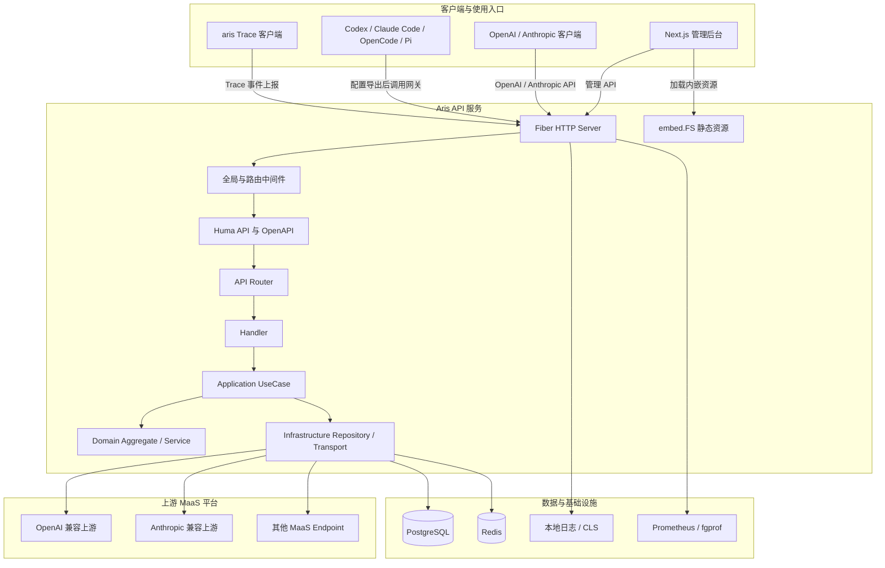

### 服务启动链路

服务端和 Trace 客户端是两个独立的 Go 程序入口：

- 服务端入口为 `cmd/server/main.go`，通过 `execute()` 进入 Cobra 根命令。
- 执行 `server start` 后读取 host 和 port 参数，输出当前运行环境和关键资源配置。
- `bootstrap.BuildFxApp` 创建应用实例，并将基础设施、Cron、Repository、Application 和 Handler 模块加入依赖注入容器。
- Fiber 应用和 Huma API 由容器提供，随后注册全局中间件、路由和生命周期钩子。
- 服务端启动数据库、Redis、共享 HTTP Client、Pond 协程池、Cron 模块、日志和业务服务后开始监听 HTTP 请求。
- `cmd/client` 编译为独立的 `aris` 二进制，只包含 Trace 客户端相关命令，不依赖服务端数据库、Web 静态资源或管理命令。

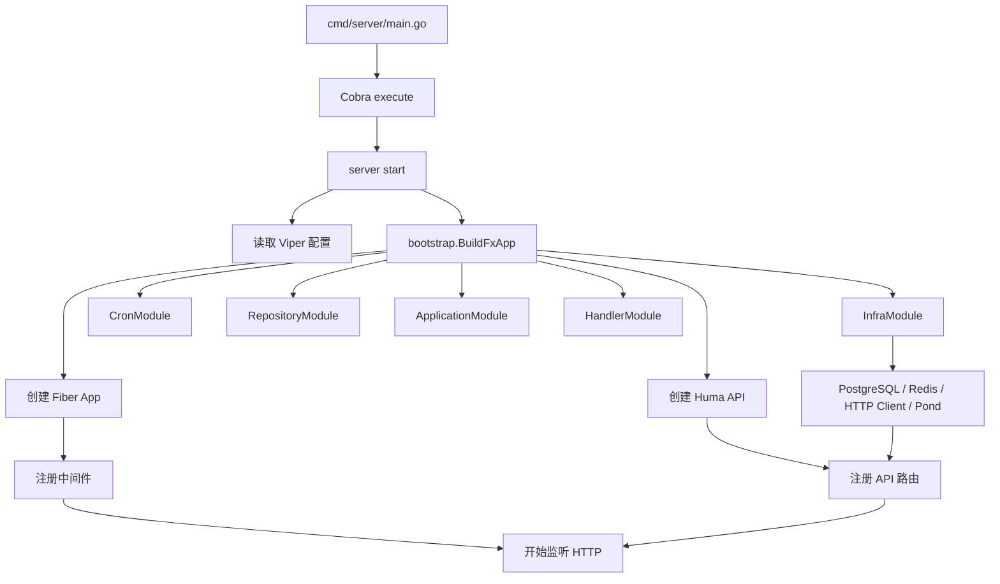

### 后端分层架构

后端按照入口适配、应用编排、领域规则和基础设施实现进行分层，主要依赖方向由上至下：

```text
HTTP Request
    |
    v
router -> handler -> application -> domain
                              |
                              +-> infrastructure
```

#### `internal/router`

负责将 URL、HTTP Method、OperationID、标签、安全方案和中间件绑定到 Handler。路由按领域拆分，包括用户、Token、OAuth2、API Key、Session、Endpoint、Model、Audit、Cron、Blocked、Dataset、Trace、Metrics 以及 OpenAI/Anthropic 代理入口。

#### `internal/handler`

负责 HTTP 层适配，将 Huma 绑定后的请求 DTO 交给 Application Handler，并将 UseCase 结果转换为 HTTP 响应。Handler 不负责数据库查询、上游 HTTP 调用或复杂业务规则。

#### `internal/application`

负责应用用例和业务流程编排，按领域划分为 `identity`、`apikey`、`session`、`endpoint`、`model`、`audit`、`dataset`、`trace`、`blocked`、`cronmgmt`、`cronaudit`、`metrics` 和 `llmproxy` 等模块。Application 层通过 Port 依赖仓储、缓存、签名器、转换器和传输服务。

#### `internal/domain`

负责稳定的领域概念和领域规则，包括 User、ProxyAPIKey、Endpoint、Model、Session、Message、Tool、ModelCallAudit、Blocked 和 Trace 等聚合、值对象、领域服务与 Repository 接口。领域层不依赖 Fiber、Huma 或具体数据库实现。

#### `internal/infrastructure`

负责外部系统适配和具体实现，包括 PostgreSQL/GORM Repository、Redis Cache、JWT、OAuth2 Client、HTTP Client、LLM Transport、对象访问和协程池。基础设施实现通过接口被 Application 或 Domain 使用。

#### `internal/common`

保存跨模块共享的常量、枚举、错误、上下文键、值对象、统一消息结构、限流参数、Redis Key、路由常量和通用工具，避免业务模块重复定义协议和基础约定。

### 依赖注入与模块注册

项目使用 Uber Dig/Fx 管理服务端对象图。`internal/bootstrap/container.go` 将依赖按模块组织，并集中注册应用入口：

- `InfraModule`：数据库、Redis、HTTP Client、日志、JWT、对象访问、Pond 等基础设施。
- `CronModule`：Session 去重、摘要、Think 提取、软删除清理等定时任务。
- `RepositoryModule`：用户、API Key、Session、Message、Tool、Endpoint、Model、Audit、Trace 等仓储实现。
- `ApplicationModule`：各领域 Command、Query、UseCase、Converter 和 Port 实现。
- `HandlerModule`：HTTP Handler 以及管理 API 和代理 API 的依赖。
- `fx.Provide`：创建 Fiber App 和 Huma API。
- `fx.Invoke`：注册中间件、路由和应用生命周期钩子。

这种组织方式让测试可以通过 `fx.Option` 替换数据库、缓存、Repository 或 Handler 依赖，也使启动和关闭资源的责任集中在 Bootstrap 层，而不是散落在业务代码中。

### HTTP 请求处理链路

所有请求首先进入 Fiber 全局中间件，再由 Huma 完成路由匹配和 DTO 绑定。不同资源组会叠加 JWT、API Key、权限和限流中间件。

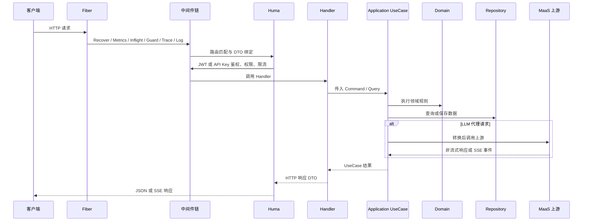

全局中间件的实际注册顺序为：

1. `Recover`：捕获 Panic，避免单个请求导致进程退出。
2. Metrics：记录请求和运行时指标。
3. Inflight：追踪进行中的请求，为优雅关闭提供 draining 基础。
4. Guard：识别异常访问和路由扫描行为。
5. Fgprof：提供性能分析入口。
6. CORS：处理跨域请求。
7. Compress：压缩适合压缩的响应。
8. Trace：生成或传递 Trace ID，并写入响应头。
9. Locale：解析请求语言环境。
10. Log：输出结构化请求日志，并对健康检查等高频路径进行采样。

### LLM 代理模块结构

LLM 代理将“请求协议适配”“模型路由”“上游传输”“响应转换”和“数据沉淀”拆开：

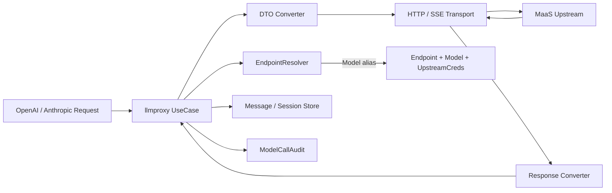

- `EndpointResolver` 接收客户端模型别名，查询 Model 映射和 Endpoint 配置，组装目标真实模型名与协议对应的 `UpstreamCreds`。
- UseCase 根据入口协议、上游支持能力和模型配置选择原生转发或跨协议转换路径。
- Converter 将客户端 DTO 转换为上游 DTO，或者将上游响应和 SSE 事件转换为客户端协议。
- Transport 负责 HTTP 请求、认证 Header、公共 Header 透传、SSE 读取、响应状态处理和退避重试。
- UseCase 在响应链路旁路提交 Message、Tool、Session 和 ModelCallAudit 异步任务，避免持久化操作阻塞客户端响应。

### 前端静态资源构建流程

管理后台不是独立部署的 Node 服务，而是构建后由 Go API 服务统一提供：

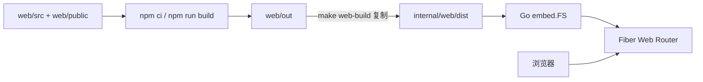

- 本地执行 `make web-build` 时，先在 `web/` 执行 `npm ci` 和 `npm run build`。
- Next.js 静态产物输出到 `web/out`，随后被复制到 `internal/web/dist`。
- Go 代码通过 `embed.FS` 编译进服务端二进制，路由层通过 Web Router 提供管理后台资源。
- Docker 构建时前端和 Go 服务在多阶段构建中完成，最终镜像只需要运行一个非 root Go 进程。

### 生命周期与资源关闭

服务收到 `SIGINT` 或 `SIGTERM` 后进入优雅关闭流程，重点是先停止新的后台任务和流量，再释放外部资源：

1. 停止 Cron 调度，避免关闭期间继续创建新的维护任务。
2. 停止 Pond 协程池提交新的异步任务，并等待已提交任务完成。
3. 将应用标记为 draining，`/ready` 开始返回不可接收流量的状态。
4. 等待进行中的 HTTP 请求和 SSE 请求完成。
5. 关闭 Fiber HTTP Server。
6. 同步并刷新日志输出。
7. 关闭 PostgreSQL 数据库连接。
8. 关闭 Redis 客户端连接。

Kubernetes 部署将 `terminationGracePeriodSeconds` 设置为 660 秒，并使用 `preStop: sleep 10` 给就绪探针传播和负载均衡摘流留出时间；应用内部的 draining 机制负责拒绝新流量并尽可能完成已有长连接请求。

## 功能详解

### LLM 代理与协议转换

LLM 代理是平台的核心业务能力，负责把客户端请求从统一网关转发到配置好的 MaaS Endpoint，并在客户端协议和上游协议不一致时完成转换。

#### 支持的协议入口

- OpenAI Chat Completions：`/api/openai/v1/chat/completions`
- OpenAI Responses：`/api/openai/v1/responses`
- Anthropic Messages：`/api/anthropic/v1/messages`
- OpenAI 模型列表：`/api/openai/v1/models`
- Anthropic 模型列表：`/api/anthropic/v1/models`
- Anthropic Token 计数：`/api/anthropic/v1/messages/count_tokens`

#### 模型路由过程

客户端提交对外模型别名后，网关依次完成以下工作：

1. APIKeyMiddleware 从 `X-API-Key` 获取 Proxy API Key，并验证密钥是否存在、有效和未被禁用。
2. 网关从请求中提取模型别名和入口协议。
3. EndpointResolver 查询 Model 映射，收集与别名关联的 Endpoint。
4. 从候选 Endpoint 中选择目标端点，并获取入口协议对应的 Base URL、共享 API Key 和接口支持标记。
5. 将客户端模型别名替换为上游真实模型名。
6. 根据入口协议和上游协议选择原生转发或跨协议 Converter。
7. 通过 Transport 发起上游 HTTP/SSE 请求。
8. 将上游响应转换为客户端协议后返回，同时异步写入 Session、Message、Tool 和 ModelCallAudit。

#### 跨协议能力

当前代码支持以下主要组合：

- OpenAI Chat Completions → OpenAI Chat Completions
- OpenAI Chat Completions → Anthropic Messages
- OpenAI Responses → OpenAI Responses
- OpenAI Responses → OpenAI Chat Completions
- OpenAI Responses → Anthropic Messages
- Anthropic Messages → Anthropic Messages
- Anthropic Messages → OpenAI Chat Completions

转换内容覆盖基础消息、角色、文本、多模态内容、推理内容、工具定义、工具调用、工具结果、停止原因、Token usage 和流式事件。

#### 流式响应

- 客户端通过请求中的流式参数选择 SSE 响应模式。
- Transport 从上游读取 SSE 事件，Converter 按入口协议逐事件转换。
- OpenAI Chat 使用增量 Choice 事件，OpenAI Responses 使用 Response event，Anthropic 使用 message start、content block、delta 和 message stop 等事件。
- 工具调用的名称、ID、参数增量和结果会在流式过程中持续转换和累积。
- 流结束后记录最终 Token usage、结束原因、首 Token 延迟和流式持续时间。
- 上游连接错误、协议解析错误和转换错误会保留在调用状态和日志中，便于使用 Trace ID 继续排查。

#### 上游退避与重试

- 默认最多额外重试 2 次，不包含首次请求。
- 默认初始退避时间为 500ms，最大退避时间为 2s，抖动因子为 0.3。
- 重试参数通过 `UPSTREAM_RETRY_*` 配置项调整。
- Transport 统一封装重试逻辑，避免每个协议 UseCase 重复实现。
- 对连接错误、临时性上游错误等可恢复场景进行有限重试；已经产生不可逆副作用的请求不应被无条件重复提交。

### 用户、OAuth2、JWT 与权限

#### OAuth2 登录

平台支持 GitHub 和 Google OAuth2：

- 前端请求 OAuth2 登录接口获取授权地址。
- 用户在第三方平台完成授权后，第三方回调授权码和 state。
- 服务端校验 state，通过授权码获取第三方用户信息。
- 根据第三方平台用户 ID 查找已有用户，或创建新用户并绑定平台信息。
- 登录成功后签发 Access Token 和 Refresh Token。
- OAuth2 回调接口使用独立的 Redis 令牌桶限流，降低状态枚举和回调滥用风险。

#### JWT TokenPair

- Access Token 用于管理后台 API 鉴权，生命周期较短。
- Refresh Token 用于换取新的 Access Token，生命周期较长。
- JwtMiddleware 从 `Authorization: Bearer <token>` 提取 Token，验证签名、有效期和 Redis 侧状态。
- 鉴权成功后将 UserID 和 Permission 注入请求上下文。
- Token 刷新接口单独限流，避免被高频调用消耗服务资源。

#### 权限等级

平台使用三级权限：

- **`pending`**：新注册用户的初始状态，功能受限，等待审核。
- **`user`**：普通用户，可以管理自己的 Proxy API Key、查看自己拥有的数据、管理自己的 Session 和执行个人数据导出。
- **`admin`**：管理员，可以管理全局 Endpoint、Model、敏感词和 Cron，并查看跨用户资源和全局统计。

权限判断通过权限等级比较和路由级权限中间件完成；资源归属校验仍由具体 UseCase 或 Repository 查询条件负责，避免只依赖路由权限造成越权。

### Proxy API Key

Proxy API Key 是客户端调用 LLM 网关和上报 Trace 的主要凭证。

- 用户可以创建、查看列表和删除自己的 Proxy API Key。
- 每个 API Key 有名称、所属用户、密钥值和创建时间。
- 创建时由服务端生成密钥，并只在创建响应中返回明文。
- 后续列表和详情只返回脱敏后的密钥，服务端不会再次向普通 API 返回完整密钥。
- 用户创建新 Key 前会检查当前 Key 数量是否超过配额。
- API Key 管理接口使用 JWT 鉴权，并按用户维度增加操作限流。
- 管理员可以查看和处理全局 Key，但普通用户只能访问自己名下的 Key。
- LLM 代理调用使用 `X-API-Key`，Trace 客户端上报也使用 API Key 做 Owner 隔离。

### Endpoint 与 Model 管理

Endpoint 和 Model 共同构成模型路由配置：

#### Endpoint

- 配置 Endpoint 名称和上游连接信息。
- 分别配置 OpenAI Base URL 和 Anthropic Base URL。
- 配置供上游调用的共享 API Key。
- 配置是否支持 OpenAI Chat、OpenAI Responses 和 Anthropic Messages 等接口。
- 支持管理员新增、列表、更新和删除 Endpoint。
- Endpoint 管理接口要求管理员权限，并使用用户维度限流保护管理操作。

#### Model

- 配置客户端可见的 `alias`。
- 配置上游实际使用的 `model` 名称。
- 通过 `endpoint_id` 将模型别名绑定到一个或多个 Endpoint。
- 同一别名关联多个 Endpoint 时，Resolver 可以从候选配置中选择目标上游。
- 支持管理员新增、列表、更新和删除 Model 映射。
- 模型配置是客户端接入层和上游实现之间的隔离边界，切换上游时无需修改客户端请求中的模型别名。

### Session、Message、Tool 与分享

#### Session 聚合

Session 是对一次模型交互的业务聚合，通常由代理调用链路创建，并关联：

- API Key Owner
- 客户端使用的模型别名和上游真实模型名
- Message 和 Tool 引用
- 会话创建时间、更新时间和摘要信息
- 人工评分及评分时间
- 调用协议和请求上下文

#### Message 与 Tool

- Message 使用协议无关的 UnifiedMessage 结构保存内容。
- 内容支持文本、多模态 parts、推理内容、ToolCalls、ToolCallID、Refusal 和压缩相关字段。
- Tool 保存工具调用 ID、调用参数、执行结果和工具定义关联信息。
- Message 和 Tool 通过 checksum 内容寻址，降低重复存储。
- 数据以不可变记录为主，不提供任意修改历史 Message 的接口，避免破坏审计和训练数据一致性。
- Session 详情接口将 metadata、Message、Tool 分开分页，避免一次性加载大量完整上下文。

#### 会话管理

登录用户可以：

- 分页查看自己拥有的 Session。
- 查看 Session 元数据、Message 和 Tool。
- 按模型、评分等条件查询。
- 对 Session 进行 1-5 分人工评分，重复评分覆盖原评分。
- 删除自己拥有的 Session；管理员可按权限处理全局资源。
- 创建、查询和删除 Session 分享链接。

#### Session 分享

- 分享链接以 UUID 作为公开标识。
- 分享状态保存在 Redis，默认 TTL 为 24 小时，并支持 1 天、7 天、30 天、永久或自定义时长。
- 使用 `session_shares:{sessionID}` 反向 Set 防止同一 Session 重复创建相同分享关系。
- 公开访问不要求登录，但 metadata、Message 和 Tool 查询均有独立的 IP 维度限流。
- 分享数据仍受 Owner 维度和分享状态控制，删除分享后公开链接失效。

### 模型调用审计与统计

每次模型调用都会形成 ModelCallAudit，核心字段包括：

- API Key ID 和 Model ID
- 客户端模型名、上游真实模型名
- 入口协议和上游协议
- Endpoint 信息
- Input、Output、CacheCreation、CacheRead 四维 Token 统计
- FirstToken 和 Stream 两段调用延迟
- 上游 HTTP 状态码和错误信息
- User-Agent、Trace ID、调用开始和结束时间

审计记录通过异步任务提交到 Pond Store 池，减少对实时模型响应的阻塞。管理后台可以通过审计 API 查询：

- 模型调用记录列表和筛选选项。
- 按模型和时间粒度聚合的调用趋势。
- 请求成功率和失败率。
- Token 总量、输出 Token 吞吐和输出 Token 速率。
- 按模型聚合的使用量。
- 首 Token 平均延迟。
- Cron 调用审计记录和 Cron 类型筛选项。

管理员可以查看全量审计数据，普通用户只能查看自己 API Key 下的调用记录。

### 敏感词拦截

敏感词模块用于在 LLM 请求进入上游前执行内容治理：

- 管理员可以创建、列表查询和删除敏感词条目。
- 服务启动时从数据库加载全部活跃敏感词，并构建 Aho-Corasick 自动机。
- 自动机由读写锁保护，普通请求检查时使用读锁，词条变更时重建自动机。
- 代理请求会检查相关文本内容，命中后返回 `403 Forbidden`，不继续调用上游。
- 命中的词条 ID 先通过 Redis 递增命中计数，之后由定时任务批量同步回 PostgreSQL。
- 敏感词管理接口只允许管理员访问，命中事件会进入日志和调用审计上下文。

### 数据集预览与 ShareGPT 导出

Dataset 模块将已沉淀的 Session 转换为可供训练侧使用的 ShareGPT JSONL：

#### 筛选与预览

- 支持按评分阈值筛选，优先导出人工标注质量较高的 Session。
- 支持按模型和时间范围筛选数据。
- 预览接口返回匹配 Session 数量、评分分布、模型分布和估算 Token 总量。
- 格式预览接口可以查看指定结果位置的完整 ShareGPT 转换结果。
- 管理员可以查看全量范围，普通用户只查看自己 API Key 产生的 Session。

#### 导出格式

- 使用 JSONL，每行对应一个完整 Session。
- `conversations` 数组保存 system、user、assistant 和 function 等角色消息。
- assistant 消息将推理内容组织为 `<think>...</think>`，再拼接可见回答内容。
- 工具调用映射为 `function_call`，工具响应映射为 `function` 角色。
- 工具定义写入 `tools` 数组。
- 导出采用 HTTP 流式响应，不将完整文件先写入服务端磁盘或数据库。

### Cron 定时任务

平台的定时维护任务遵循统一的 CronRegistryEntry 注册模式，并支持管理员查看和启停：

- **SessionDedup**：按 Message/Tool checksum 查找重复引用，合并冗余关系，并软删除空 Session。
- **SessionSummarize**：为符合条件的 Session 生成或更新摘要，减少详情列表加载成本。
- **ThinkExtract**：从已保存内容中提取推理内容，规范化训练数据所需的思维链字段。
- **SoftDeletePurge**：计算已删除 Session 不再引用、且活跃 Session 也不引用的 Message/Tool，清理孤儿记录。
- **SessionScore**：代码中保留历史任务配置兼容，但原有自动评分能力已不作为当前主要产品流程，当前评分以人工评分接口为主。

所有 Cron 在多副本环境中通过 Redis 分布式锁串行执行，同一任务同一时间只有一个实例获得执行权。任务执行状态和调用审计可以从管理后台查询。

### Codex Trace 与 `aris` 客户端

Trace 子系统为 Agent Harness 提供独立于普通 LLM Proxy Session 的观测数据入口。

#### 客户端采集

- `aris` 是独立编译的 CLI，当前包含 Trace 相关命令。
- 支持 Darwin amd64/arm64 和 Linux amd64/arm64。
- 客户端读取 Codex Hook 事件和 rollout 记录。
- 事件先以 `0600` 权限原子写入 `~/.aris/trace/spool/`，网络上报失败时保留待处理记录。
- 客户端以批量方式上报，单次上报有超时限制，服务端返回 `accepted` 或 `duplicate` 后删除 pending 记录。
- 被服务端拒绝的记录进入隔离区，便于后续排查。
- spool 全局上限为 256 MiB，达到上限时停止接收新记录，但保留已有未确认记录，采集过程保持 fail-open。

#### 服务端处理

- Trace 上报接口通过 Proxy API Key 识别 Owner。
- 服务端对事件进行结构化解析、去重和持久化。
- Trace 查询通过 JWT 鉴权，普通用户只允许访问自己 Owner 范围内的数据。
- Trace 页面展示 Trace 列表、详情、事件时间线和重建后的会话。
- TraceConversation 以 rollout 为优先数据源，以 Hook 事件作为 fallback，按 turn 分组并按 `call_id` 关联工具调用和结果。

#### 安装方式

- 服务端提供 `GET /install.sh`，返回自包含的 Trace 客户端安装脚本。
- 安装脚本根据本机平台下载 GitHub Releases 中对应的 `aris` 二进制。
- 当前方案不再使用旧版的客户端下载 ticket、服务端二进制下载接口或旧的 curl Hook 体系。

### OpenCode、Claude Code、Codex 与 Pi 配置导出

管理后台从 Model 列表选择模型后，可以针对不同 Agent Harness 生成本地配置：

- OpenCode 使用 provider 字典注册模型，并 patch `~/.config/opencode/opencode.json`。
- Claude Code 将模型分配到 opus、sonnet、haiku 三个档位，写入对应的默认模型环境变量，并 patch `~/.claude/settings.json` 的 env 块。
- Codex 写入自定义 `model_providers`、默认模型和 `model_context_window`，patch `~/.codex/config.toml`。
- Pi 生成 provider 和模型数组，使用模型 alias 作为模型 ID，patch `~/.pi/agent/models.json`。
- Claude Code 对 1M context 模型使用 `[1m]` 后缀标记，代理转发前剥离该后缀。
- 导出脚本内嵌 Python 完成幂等 patch，重复执行只更新目标配置，不追加重复节点。
- 修改前会备份原配置为 `.bak`，通过同目录临时文件和原子替换写回。
- 配置文件包含凭证时按 `0600` 权限保存。

### Web 管理后台

Web 前端通过 Go 服务统一托管，主要页面和能力包括：

- 登录页和 OAuth2 回调页。
- Dashboard 首页和模型调用概览。
- Profile 个人资料页。
- API Key 管理页。
- Endpoint 和 Model 管理页。
- Session 列表、Session 详情、消息和工具查看页。
- Session 分享列表和公开分享页。
- Model Audit、Cron Audit 和统计图表页。
- Dataset 预览、格式预览和导出页。
- Blocked 敏感词管理页。
- Cron 任务管理页。
- Monitor 运行时监控页。
- Trace 列表、详情、事件时间线、Conversation 和客户端安装页。
- OpenCode、Claude Code、Codex、Pi 配置导出对话框。

前端通过统一 API Client 调用 Huma API，使用本地化资源支持中文、英文和日文界面，并通过权限 Guard 隐藏或限制普通用户不可访问的管理功能。

## 技术实现细节

### 请求入口与路由注册

服务端将 Fiber 作为 HTTP 承载层，将 Huma 作为 API 描述、请求绑定和 OpenAPI 注册层：

```go
func NewHumaAPI(app *fiber.App) huma.API {
    return humafiber.New(app, huma.Config{
        OpenAPI: &huma.OpenAPI{ /* API 元数据与安全方案 */ },
        OpenAPIPath: lo.If(config.Env != enum.EnvProduction,
            constant.OpenAPIDocsPath).Else(""),
        SchemasPath: lo.If(config.Env != enum.EnvProduction,
            constant.OpenAPISchemasPath).Else(""),
    })
}
```

路由注册时先创建 `/api` 和 `/api/v1` 分组，再为不同领域创建子分组：

- `/api/v1/user`、`/api/v1/token`、`/api/v1/oauth2`
- `/api/v1/apikey`、`/api/v1/session`
- `/api/v1/endpoint`、`/api/v1/model`
- `/api/v1/audit`、`/api/v1/cron`、`/api/v1/block`
- `/api/v1/dataset`、`/api/v1/metrics`、`/api/v1/trace`
- `/api/openai/v1`
- `/api/anthropic/v1`

开发环境会注册 `/docs`、`/openapi.json` 和 Schema 路由，便于查看和调试接口；生产环境通过配置关闭文档和 Schema 暴露，降低接口结构被公开枚举的风险。健康检查路由和 Trace 安装脚本路由属于全局路由，不依赖 `/api/v1` 分组。

### 双鉴权链路

管理 API 和模型代理 API 的访问场景不同，因此使用两套相互独立的认证方式。

#### 管理 API：JWT

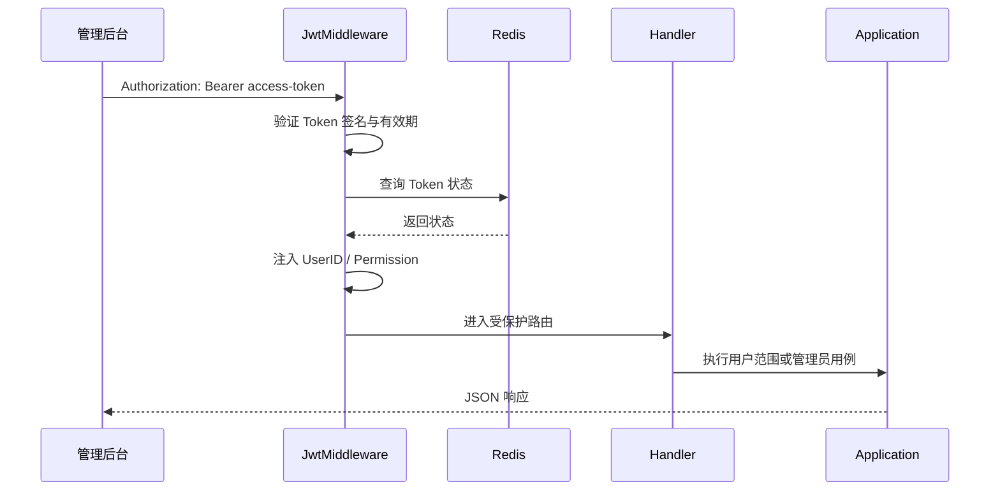

- JwtMiddleware 从 `Authorization` Header 提取 Bearer Token。
- 验证通过后，将 UserID 和 Permission 放入请求 Context。
- 路由通过 `LimitUserPermissionMiddleware` 声明最低权限等级。
- UseCase 或 Repository 继续根据 Owner、UserID 和资源 ID 执行细粒度归属校验。

#### LLM/Trace API：Proxy API Key

```go
openaiGroup.UseMiddleware(
    middleware.APIKeyMiddleware(db),
    middleware.HeaderPassthroughMiddleware(),
)
```

- APIKeyMiddleware 从 `X-API-Key` 提取密钥。
- 服务端查询数据库并验证密钥状态。
- 验证成功后，将 UserID、APIKeyID、APIKeyName 和 Permission 注入请求 Context。
- 代理 UseCase 使用 APIKeyID 作为限流、审计和数据 Owner 维度。
- Trace 上报使用同样的 API Key 机制，保证客户端上报数据与 Key Owner 关联。

两套鉴权链路的边界是：JWT 负责“管理谁可以操作平台资源”，Proxy API Key 负责“哪个客户端可以调用模型网关或上报 Trace”。二者不能仅通过 URL 路径互相替代。

### LLM 代理执行流程

一次模型代理调用在 Application 层由 UseCase 编排，领域服务负责模型路由，Infrastructure 层负责数据库和上游传输：

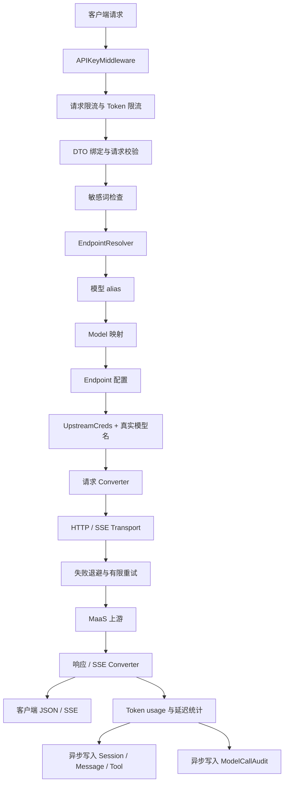

典型执行顺序如下：

1. 路由级 API Key Middleware 先完成调用方识别。
2. 请求级令牌桶检查请求频率，Token 令牌桶检查当前可用 Token 额度。
3. Huma 将请求 Body、Path 和 Query 绑定到协议 DTO，并执行结构校验。
4. BlockedService 检查请求中的文本、工具内容和相关可检查字段。
5. UseCase 调用 EndpointResolver，按模型 alias 查找 Model 和 Endpoint。
6. Resolver 组装入口协议对应的 Base URL、上游 API Key、真实模型名和接口能力。
7. Converter 负责将客户端 DTO 转换为上游协议 DTO；原生路径可以跳过不必要的协议转换。
8. Transport 发送请求并处理 HTTP 状态、Header、SSE 事件和重试。
9. 响应 Converter 将上游完整响应或增量事件转成客户端协议。
10. UseCase 统计 Token 和延迟，并把消息、工具、Session 与审计任务提交到后台池。

### EndpointResolver 与模型解析

EndpointResolver 的核心输入是客户端提交的模型 alias，输出是可用于上游调用的模型和凭证组合：

```text
alias
  |
  +-- 查询 model 表
  |      |
  |      +-- model.alias = alias
  |      +-- 收集 endpoint_id
  |
  +-- 查询 endpoint 表
         |
         +-- 选择目标 Endpoint
         +-- 读取真实 model 名称
         +-- 按 ProtocolType 选择 Base URL
         +-- 组合 UpstreamCreds
```

解析过程的关键约束：

- alias 是客户端稳定使用的名字，真实模型名属于上游适配细节。
- 同一 alias 可以关联多个 Endpoint，为多供应商或多实例部署提供候选目标。
- OpenAI 和 Anthropic 可能使用同一 Endpoint 的不同 Base URL，Resolver 必须依据入口/上游协议选择正确配置。
- 如果目标 Endpoint 不支持请求所需的 ProtocolType，UseCase 不会强行发起不兼容的上游调用。
- 解析失败、没有候选模型、凭证缺失或协议能力不匹配，会在进入上游前转换为统一业务错误。

### 跨协议转换实现

代理转换分为请求转换、响应转换和流式事件转换三类：

#### 请求转换

- OpenAI Chat 的 `messages` 转换为 Anthropic 的 `system` 和 `messages`。
- OpenAI Responses 的 input items 转换为统一消息，再根据目标协议生成 Chat 或 Anthropic 请求。
- Anthropic content blocks 转换为统一文本、图片、工具调用和工具结果结构。
- 不同协议的工具定义字段被映射到统一 Tool 描述，再输出到目标协议的 tools 字段。
- 上游真实模型名、最大 Token、temperature、top_p、stop、stream 等参数按目标协议重新编码。

#### 响应转换

- OpenAI Chat 响应转换为 Anthropic message 响应时，重新组织 role、content、stop_reason 和 usage。
- Anthropic 响应转换为 OpenAI Chat 时，将 content blocks 合并为 message/content，并映射 tool use。
- OpenAI Responses 和 Chat 之间需要对 response item、output text、tool call 和结束事件重新建模。
- 对于协议不存在的一一对应字段，Converter 使用统一模型或约定映射，避免直接把上游私有结构泄露给客户端。

#### SSE 事件转换

SSE 转换器不能简单地按 JSON 字段复制，因为三个协议的事件生命周期不同。实现需要维护当前 content block、工具调用和响应状态：

```text
上游 SSE event
    |
    +-- 解析事件类型和 JSON data
    +-- 更新当前文本/推理/工具调用状态
    +-- 累积不完整的参数增量
    +-- 映射为客户端协议事件
    +-- 编码为 data: ...\n\n
    +-- 在 stop/done 事件中补齐 usage 和结束原因
```

该设计使协议转换可以同时支持普通文本增量、Reasoning 增量、工具名称和参数增量，以及最终 usage 和 stop reason。

### 上游重试与退避实现

重试参数在配置初始化阶段读取：

```go
config.SetDefault("upstream.retry.max_attempts", 2)
config.SetDefault("upstream.retry.initial_backoff", 500*time.Millisecond)
config.SetDefault("upstream.retry.max_backoff", 2*time.Second)
config.SetDefault("upstream.retry.jitter_factor", 0.3)
```

Transport 层依据配置执行有限重试，概念上的等待时间为：

```text
backoff = min(initial_backoff * 2^attempt, max_backoff)
jittered_backoff = backoff * (1 + random(-jitter_factor, +jitter_factor))
```

实现边界包括：

- 重试次数是额外次数，不包含首次调用。
- 重试必须受请求阶段和错误类型约束，不能把已产生副作用的操作当成普通幂等查询。
- 流式响应一旦已经向客户端发送部分内容，不能简单地从头重试并拼接两个响应流。
- 每次尝试的上游状态、错误和最终结果都应能通过日志与 Trace ID 关联。
- 达到最大次数后返回最后一次可用的上游错误信息，并由 ModelCallAudit 记录失败状态。

### Session、Message、Tool 持久化与去重

模型调用保存的数据分为业务聚合、不可变内容和关系引用：

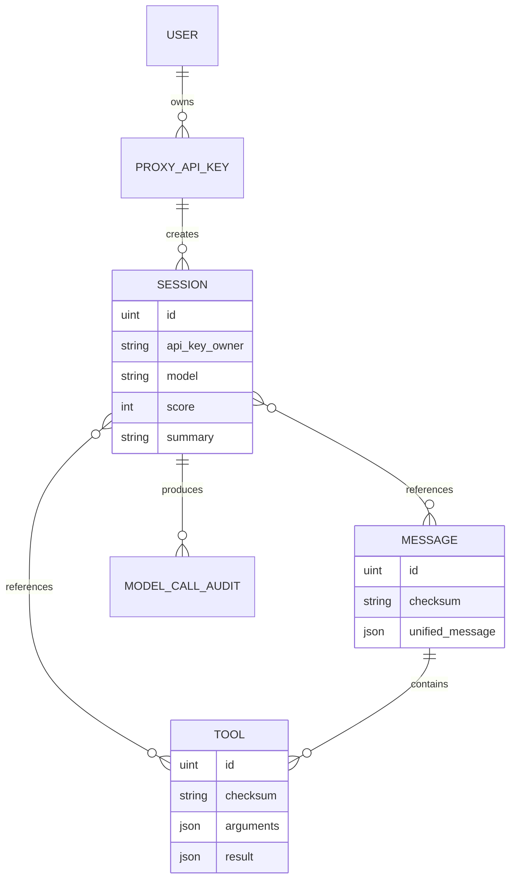

- Session 保存会话级元数据和 Message/Tool 引用。
- Message 和 Tool 内容以 JSON 形式保存，领域层使用 UnifiedMessage 和统一 Tool 结构处理。
- 持久化前根据内容生成 checksum，Repository 先查找已有内容，已存在时复用已有记录。
- Session 去重任务可以根据 checksum 比对跨 Session 的重复引用，合并冗余关系。
- 软删除清理任务只删除不再被任何活跃 Session 引用的孤儿 Message/Tool，避免共享内容被误删。
- Session 详情查询默认先加载 metadata，Message 和 Tool 通过独立分页接口按需加载。

### SessionDetailCache 与数据库降级

Session 详情缓存按读取对象拆分为三层：SessionMeta、Message 和 Tool：

- Redis Key 按 Session ID 和分页参数组织。
- 默认缓存 TTL 为 1 小时。
- 缓存命中时直接返回序列化后的详情数据。
- 缓存未命中时查询 PostgreSQL，再将结果写回 Redis。
- Redis 读取、反序列化或写入失败时降级到数据库，不让缓存故障阻断 Session 查看。
- 当前设计不依赖主动失效，数据更新后的最终一致性由 TTL 和查询降级保证。

### 异步落库与 Pond 协程池

模型响应属于用户感知链路，消息和审计写入属于后台持久化链路，项目通过 Pond 将二者分离：

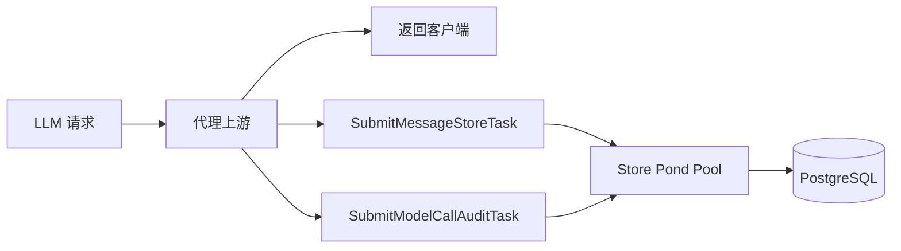

- Store 池用于消息、Session 和审计等持久化任务。
- Agent 池用于摘要、思维链提取等 Agent/后台处理任务。
- Worker 数量和队列容量通过 `POOL_*` 或分组配置读取。
- 主请求完成后，后台任务可以继续执行，但任务必须服从 Context、队列容量和关闭信号。
- 服务关闭时停止接收新任务，等待已提交任务完成；超出关闭窗口的任务由应用关闭超时机制处理。

### Redis 缓存、限流与分布式锁

#### 请求令牌桶

- 以 API Key ID、UserID 或客户端 IP 作为维度。
- 每个接口使用独立的 Redis Key 前缀，避免不同接口共享计数。
- 令牌不足时直接返回 429，并提供重试等待信息。

#### Token 令牌桶

- 请求开始前检查 Token 桶当前可用量，不直接消耗全部预估值。
- 上游响应结束后由 TokenUsageReporter 上报实际 Input + Output Token。
- Redis Lua 脚本在服务端原子完成扣减，避免并发请求产生竞态。
- 支持缓存读取、缓存创建等协议特有 Token 统计字段进入审计，但限流主要按实际输入和输出 Token 计算。

#### Cron 分布式锁

```text
SET cron:lock:{module} <instance-id> NX EX <ttl>
    |
    +-- 成功：当前实例执行 Cron
    +-- 失败：其他实例持有锁，本轮跳过
    +-- TTL 到期：异常退出后自动释放
```

锁使用 TTL 防止持锁实例崩溃造成永久阻塞。任务执行和锁释放都在 Cron Runner 中统一处理。

### Trace 数据管线

Trace 数据从本地 Agent Harness 事件进入客户端 spool，再经过 API Key 鉴权和持久化，最终在 Web 页面中重建为可阅读会话：

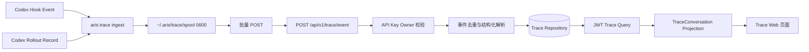

客户端侧：

- Hook 和 rollout 记录先转换为结构化事件，再以临时文件写入和 rename 的方式原子落盘。
- pending 记录包含上报所需的原始内容和状态，网络失败时不立即丢弃。
- 批量上报收到 `accepted` 或 `duplicate` 后删除 pending。
- `rejected` 记录转移到隔离区，避免无限重试污染主队列。
- spool 达到 256 MiB 上限后停止接收新记录，但不主动删除尚未确认的数据。

服务端侧：

- API Key Middleware 建立 Trace Owner 隔离。
- Handler 将事件交给 ReportTraceEvent Application Command。
- Repository 负责原始事件去重和持久化。
- 查询侧通过 trace ID、事件分页和会话投影读取数据。
- TraceConversation 将 rollout 记录优先映射为 turn，在缺少 rollout 时使用 Hook 事件补全；工具调用和结果通过 `call_id` 对齐。

### Huma DTO、OpenAPI 与响应边界

Huma Operation 同时声明 HTTP 方法、路径、Summary、Tags、Security 和 Handler：

```go
huma.Register(openaiGroup, huma.Operation{
    OperationID: "createChatCompletion",
    Method:      http.MethodPost,
    Path:        "/chat/completions",
    Security:    []map[string][]string{{"apiKeyAuth": {}}},
}, openaiHandler.HandleChatCompletion)
```

- Huma 根据 DTO 定义绑定 Path、Query 和 Body 参数，并生成 OpenAPI Schema。
- 路由声明的 Security Scheme 与实际 JWT/API Key Middleware 保持一致。
- Handler 返回项目统一的 HTTPResponse 包装类型，由 Huma 负责序列化。
- LLM 代理的 JSON 和 SSE 响应由协议 Handler/Converter 控制，避免统一管理 API 的响应包装污染兼容协议。
- DTO 命名、Body 包装和字段标签遵循项目自定义 lint 规则，避免请求字段绑定为零值或无法生成正确 OpenAPI Schema。

### 统一错误、日志与链路追踪

错误处理贯穿 Domain、Application、Handler 和 Middleware：

- Domain 使用统一错误类型表达校验失败、资源不存在、权限不足、配额超限和上游调用失败。
- Application 层保留业务错误上下文，不在每个 UseCase 中重复拼装 HTTP 响应。
- Handler 和 Huma 将错误映射为标准 HTTP 状态码和 JSON 错误结构。
- API Key 缺失或无效通常返回 401，权限不足返回 403，限流返回 429，参数校验错误返回 422 或对应的校验状态。
- 上游 HTTP 错误和连接错误保留上游状态码、错误信息和本地 Trace ID，避免只返回无法排查的通用错误。

Trace Middleware 会生成或复用请求 Trace ID，并通过 `X-Trace-Id` 响应头返回：

```text
客户端错误
    |
    +-- 响应头 X-Trace-Id
    +-- API 请求日志
    +-- ModelCallAudit
    +-- 上游请求日志
    +-- 腾讯云 CLS 查询
```

日志使用 Zap 结构化输出，健康检查等高频路径按采样规则降噪；生产环境可将日志发送到 CLS，根据 Trace ID 追踪完整请求链路。

### 配置加载与环境变量映射

配置模块使用独立 Viper 实例，设置点号路径到下划线环境变量的映射：

```go
config := viper.New()
config.SetEnvKeyReplacer(strings.NewReplacer(".", "_"))
config.AutomaticEnv()

config.SetDefault("read.timeout", 10*time.Second)
ReadTimeout = config.GetDuration("read.timeout")
```

因此，代码中的 `read.timeout` 对应环境变量 `READ_TIMEOUT`。主要配置分组包括：

- Server：`PORT`、`READ_TIMEOUT`、`WRITE_TIMEOUT`、`MAX_HEADER_BYTES`
- Log：`LOG_LEVEL`、`LOG_DIR`
- PostgreSQL：`POSTGRES_USER`、`POSTGRES_PASSWORD`、`POSTGRES_HOST`、`POSTGRES_PORT`、`POSTGRES_DATABASE`、`POSTGRES_SSLMODE`
- Redis：`REDIS_HOST`、`REDIS_PORT`、`REDIS_PASSWORD`
- OAuth2：GitHub/Google Client ID、Secret 和 Redirect URL
- JWT：Access/Refresh Token 有效期和 Secret
- CLS：Endpoint、Secret ID、Secret Key、Topic ID 和日志级别
- Pool：Store/Agent Worker 数量和 Queue Size
- SQL：批量写入大小
- Trusted Proxy/Guard：可信代理和路由扫描防护白名单
- Cron：Session 去重、摘要、Think 提取、软删除清理等开关
- Upstream Retry：最大尝试次数、初始退避、最大退避和抖动因子

生产配置通过 Kubernetes ConfigMap 和 Secret 注入；敏感凭证只应放入 Secret 或受保护的环境文件，不能提交到 Git 仓库。

### 优雅关闭与 Kubernetes 无损下线

应用内部通过 Inflight Tracker 和 draining 状态协作关闭：

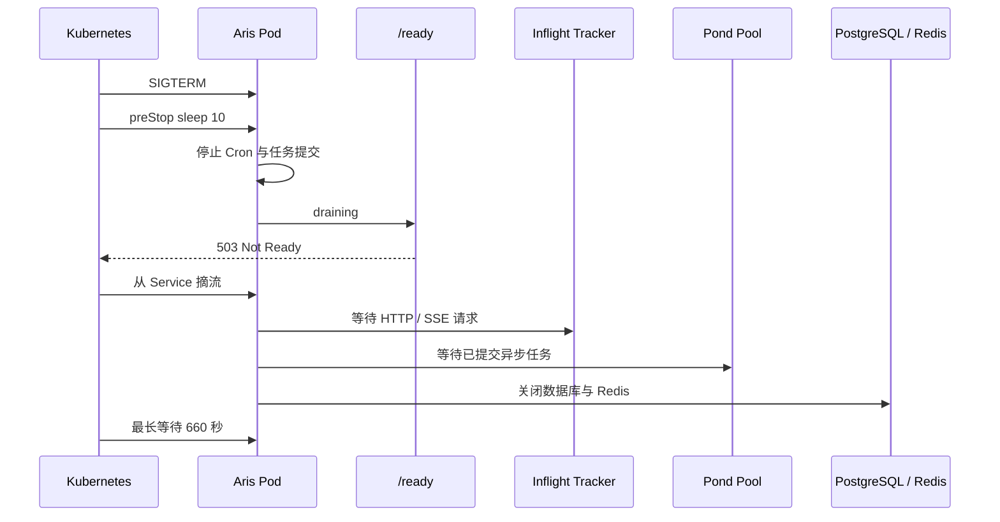

- `/health` 仍用于判断进程存活，异常时触发重启。
- `/ready` 用于决定 Pod 是否继续接收流量，draining 后返回 503。
- `preStop: sleep 10` 为 Kubernetes 就绪状态传播和 Service 摘流留出缓冲。
- `terminationGracePeriodSeconds: 660` 为长时间 SSE 或上游模型响应保留足够时间。
- 应用内部关闭超时由 Fx StopTimeout 控制，超过时间后由运行时终止未完成的资源关闭流程。

## API 路由总览

所有业务 API 由 Huma 注册，并统一挂载在 `/api` 下。管理 API 的版本前缀为 `/api/v1`，LLM 兼容入口使用独立的 `/api/openai/v1` 和 `/api/anthropic/v1` 前缀。

认证方式说明：

- **公开**：不需要 JWT 或 Proxy API Key，但部分接口有 IP 维度限流。
- **JWT**：使用 `Authorization: Bearer <access-token>`，主要用于管理后台。
- **API Key**：使用 `X-API-Key: <proxy-api-key>`，主要用于 LLM 调用和 Trace 事件上报。
- **管理员**：除认证外，还需要 `admin` 权限。
- **用户**：通常需要 `user` 或更高权限，并受资源 Owner 隔离。

### 健康检查与运行入口

| 方法 | 路径 | 认证 | 用途 |
| --- | --- | --- | --- |
| `GET` | `/health` | 公开 | 存活检查，供 Kubernetes liveness probe 使用 |
| `GET` | `/ready` | 公开 | 就绪检查，服务 draining 时返回不可接收流量状态 |
| `GET` | `/ssehealth` | 公开 | SSE 连接健康检查 |
| `GET` | `/metrics` | 公开 | 暴露 Prometheus 文本指标 |
| `GET` | `/install.sh` | 公开 | 返回自包含的 `aris` Trace 客户端安装脚本 |
| `GET` | `/docs` | 开发环境 | Scalar API Reference 页面，生产环境不注册 |
| `GET` | `/openapi.json` | 开发环境 | OpenAPI 文档，生产环境不注册 |

### OAuth2 与 Token

路径前缀：`/api/v1/oauth2`、`/api/v1/token`

| 方法 | 路径 | 认证 | 用途 |
| --- | --- | --- | --- |
| `GET` | `/api/v1/oauth2/login` | 公开 | 获取指定 OAuth 平台的授权地址，支持 GitHub/Google |
| `POST` | `/api/v1/oauth2/callback` | 公开，限流 | 使用授权码和 state 处理 OAuth2 回调并登录 |
| `POST` | `/api/v1/token/refresh` | 公开，限流 | 使用 Refresh Token 换取新的 Access Token |

OAuth2 登录和回调的具体平台由请求参数决定，state 和回调状态由服务端与 Redis 协作管理。

### 用户管理

路径前缀：`/api/v1/user`

| 方法 | 路径 | 认证 | 权限 | 用途 |
| --- | --- | --- | --- | --- |
| `GET` | `/api/v1/user/current` | JWT | 已登录 | 获取当前用户资料、权限和身份信息 |
| `PATCH` | `/api/v1/user` | JWT | `user` | 更新当前用户资料 |

### Proxy API Key 管理

路径前缀：`/api/v1/apikey`

| 方法 | 路径 | 认证 | 权限 | 用途 |
| --- | --- | --- | --- | --- |
| `POST` | `/api/v1/apikey` | JWT | `user` | 创建当前用户的 Proxy API Key |
| `GET` | `/api/v1/apikey/list` | JWT | `user` | 分页查询 API Key，管理员可查看全局范围 |
| `DELETE` | `/api/v1/apikey` | JWT | `user` | 删除当前用户拥有的 API Key，管理员可处理全局 Key |

创建 API Key 时明文只在创建响应中返回一次，列表接口只返回脱敏后的 Key。

### Session 与公开分享

路径前缀：`/api/v1/session`

#### JWT Session 管理

| 方法 | 路径 | 认证 | 权限 | 用途 |
| --- | --- | --- | --- | --- |
| `GET` | `/api/v1/session/list` | JWT | `user` | 分页查询当前用户可见的 Session |
| `GET` | `/api/v1/session` | JWT | `user` | 查询指定 Session 详情 |
| `GET` | `/api/v1/session/metadata` | JWT | `user` | 只查询 Session 元数据，不加载完整内容 |
| `GET` | `/api/v1/session/message/list` | JWT | `user` | 分页查询 Session Message |
| `GET` | `/api/v1/session/tool/list` | JWT | `user` | 分页查询 Session Tool |
| `DELETE` | `/api/v1/session` | JWT | `user` | 删除 Session，按 Owner 或管理员权限校验 |
| `POST` | `/api/v1/session/score` | JWT | `user` | 提交 1-5 分 Session 评分 |
| `DELETE` | `/api/v1/session/score` | JWT | `user` | 删除 Session 评分 |
| `GET` | `/api/v1/session/option/list` | JWT | `user` | 获取评分、模型等 Session 筛选选项 |

#### 分享链接管理

| 方法 | 路径 | 认证 | 权限 | 用途 |
| --- | --- | --- | --- | --- |
| `POST` | `/api/v1/session/share` | JWT | 已登录 | 创建 Session 分享链接 |
| `GET` | `/api/v1/session/share/list` | JWT | 已登录 | 查询当前用户创建的分享链接 |
| `DELETE` | `/api/v1/session/share` | JWT | 已登录 | 删除分享链接 |

#### 公开分享访问

| 方法 | 路径 | 认证 | 限流 | 用途 |
| --- | --- | --- | --- | --- |
| `GET` | `/api/v1/session/share/metadata` | 公开 | IP | 获取公开 Session 元数据 |
| `GET` | `/api/v1/session/share/message/list` | 公开 | IP | 分页查看公开 Session Message |
| `GET` | `/api/v1/session/share/tool/list` | 公开 | IP | 分页查看公开 Session Tool |

公开分享接口不要求 JWT，但必须提供有效的分享标识，并受独立的 Redis 令牌桶保护。

### Endpoint 管理

路径前缀：`/api/v1/endpoint`

| 方法 | 路径 | 认证 | 权限 | 用途 |
| --- | --- | --- | --- | --- |
| `POST` | `/api/v1/endpoint` | JWT | `admin` | 创建上游 Endpoint |
| `GET` | `/api/v1/endpoint/list` | JWT | `admin` | 查询 Endpoint 列表 |
| `PATCH` | `/api/v1/endpoint` | JWT | `admin` | 更新 Endpoint 配置 |
| `DELETE` | `/api/v1/endpoint` | JWT | `admin` | 删除 Endpoint |

Endpoint 配置包括上游 Base URL、共享 API Key 和 OpenAI/Anthropic 能力标记。

### Model 管理

路径前缀：`/api/v1/model`

| 方法 | 路径 | 认证 | 权限 | 用途 |
| --- | --- | --- | --- | --- |
| `POST` | `/api/v1/model` | JWT | `admin` | 创建模型别名映射 |
| `GET` | `/api/v1/model/list` | JWT | `admin` | 查询模型映射列表 |
| `PATCH` | `/api/v1/model` | JWT | `admin` | 更新模型别名、真实模型名或 Endpoint 绑定 |
| `DELETE` | `/api/v1/model` | JWT | `admin` | 删除模型映射 |

### 敏感词管理

路径前缀：`/api/v1/block`

| 方法 | 路径 | 认证 | 权限 | 用途 |
| --- | --- | --- | --- | --- |
| `POST` | `/api/v1/block` | JWT | `admin` | 创建敏感词 |
| `GET` | `/api/v1/block/list` | JWT | `admin` | 查询敏感词列表和命中计数 |
| `DELETE` | `/api/v1/block` | JWT | `admin` | 删除敏感词 |

敏感词管理接口只负责管理黑名单，实际匹配发生在 LLM 代理请求进入上游之前。

### 模型调用审计与统计

路径前缀：`/api/v1/audit`

#### 模型调用审计

| 方法 | 路径 | 认证 | 权限 | 用途 |
| --- | --- | --- | --- | --- |
| `GET` | `/api/v1/audit/model/log/list` | JWT | `user` | 分页查询模型调用审计记录 |
| `GET` | `/api/v1/audit/model/option/list` | JWT | `user` | 查询审计筛选项，如用户和模型 |

#### 模型统计

| 方法 | 路径 | 认证 | 权限 | 用途 |
| --- | --- | --- | --- | --- |
| `GET` | `/api/v1/audit/stats/model/trend` | JWT | `user` | 按时间和模型查询调用量趋势 |
| `GET` | `/api/v1/audit/stats/request/rate` | JWT | `user` | 查询请求成功率和失败率 |
| `GET` | `/api/v1/audit/stats/token/throughput` | JWT | `user` | 查询 Token 总量和输出吞吐 |
| `GET` | `/api/v1/audit/stats/token/rate` | JWT | `user` | 查询输出 Token 速率 |
| `GET` | `/api/v1/audit/stats/model/usage` | JWT | `user` | 查询按模型聚合的使用量 |
| `GET` | `/api/v1/audit/stats/token/latency` | JWT | `user` | 查询首 Token 平均延迟 |

#### Cron 审计

| 方法 | 路径 | 认证 | 权限 | 用途 |
| --- | --- | --- | --- | --- |
| `GET` | `/api/v1/audit/cron/log/list` | JWT | `admin` | 分页查询 Cron 调用审计 |
| `GET` | `/api/v1/audit/cron/option/list` | JWT | `admin` | 查询 Cron 类型等筛选项 |

### Cron 管理

路径前缀：`/api/v1/cron`

| 方法 | 路径 | 认证 | 权限 | 用途 |
| --- | --- | --- | --- | --- |
| `GET` | `/api/v1/cron/list` | JWT | `admin` | 查询所有 Cron 任务及启用状态 |
| `PATCH` | `/api/v1/cron` | JWT | `admin` | 启用或停用指定 Cron 任务 |

### 运行时监控

路径前缀：`/api/v1/metrics`

| 方法 | 路径 | 认证 | 权限 | 用途 |
| --- | --- | --- | --- | --- |
| `GET` | `/api/v1/metrics/runtime` | JWT | `admin` | 查询跨 Pod 聚合的运行时指标时间序列 |

### 数据集预览与导出

路径前缀：`/api/v1/dataset`

| 方法 | 路径 | 认证 | 权限 | 用途 |
| --- | --- | --- | --- | --- |
| `GET` | `/api/v1/dataset/preview` | JWT | `user` | 预览筛选条件下的 Session 数量、评分、模型和 Token 统计 |
| `GET` | `/api/v1/dataset/sample` | JWT | `user` | 预览某条 Session 的 ShareGPT 转换格式 |
| `GET` | `/api/v1/dataset/export` | JWT | `user` | 流式导出 ShareGPT JSONL 数据集 |

普通用户只能导出自己 API Key 产生的 Session，管理员可以按全局范围导出。

### Trace API

路径前缀：`/api/v1/trace`

#### Trace 查询

| 方法 | 路径 | 认证 | 权限 | 用途 |
| --- | --- | --- | --- | --- |
| `GET` | `/api/v1/trace/list` | JWT | `user` | 分页查询当前用户可见的 Trace |
| `GET` | `/api/v1/trace` | JWT | `user` | 查询 Trace 详情 |
| `GET` | `/api/v1/trace/event/list` | JWT | `user` | 分页查询 Trace 事件时间线 |
| `GET` | `/api/v1/trace/conversation` | JWT | `user` | 获取重建后的 Codex Conversation |

#### Trace 上报和客户端检查

| 方法 | 路径 | 认证 | 权限 | 用途 |
| --- | --- | --- | --- | --- |
| `POST` | `/api/v1/trace/event` | API Key | API Key 有效 | 上报 Codex Hook/rollout Trace 事件 |
| `GET` | `/api/v1/trace/client/check` | API Key | API Key 有效 | 检查 Trace 客户端 API Key 是否可用 |

Trace 查询和 Trace 上报使用不同的路由组：查询组使用 JWT 并执行 Owner 隔离，上报组使用 API Key 识别数据来源。

### OpenAI 兼容接口

路径前缀：`/api/openai/v1`

| 方法 | 路径 | 认证 | 限流 | 用途 |
| --- | --- | --- | --- | --- |
| `GET` | `/api/openai/v1/models` | API Key | API Key | 查询当前可用模型别名 |
| `POST` | `/api/openai/v1/chat/completions` | API Key | 请求 + Token | 创建 Chat Completion，支持流式和非流式 |
| `POST` | `/api/openai/v1/responses` | API Key | 请求 + Token | 创建 Response，支持流式和非流式 |

OpenAI 入口会叠加 Header 透传中间件，将允许的客户端请求头转发到上游；模型调用接口同时使用请求令牌桶和 Token 令牌桶。

### Anthropic 兼容接口

路径前缀：`/api/anthropic/v1`

| 方法 | 路径 | 认证 | 限流 | 用途 |
| --- | --- | --- | --- | --- |
| `GET` | `/api/anthropic/v1/models` | API Key | API Key | 查询当前可用模型别名 |
| `POST` | `/api/anthropic/v1/messages` | API Key | 请求 + Token | 创建 Anthropic Message，支持流式和非流式 |
| `POST` | `/api/anthropic/v1/messages/count_tokens` | API Key | API Key | 计算 Message、工具、图片和文档的 Token 数量 |

Anthropic 入口同样支持 Header 透传、模型别名解析、跨协议调用、SSE 转换、Token 统计和审计。

### 路由与权限关系总结

```text
公开
  ├── 健康检查、Metrics、/install.sh
  ├── OAuth2 登录/回调、Token 刷新
  └── Session 分享读取

JWT + user
  ├── 用户资料、Proxy API Key
  ├── Session、分享、审计
  ├── Dataset、Trace 查询
  └── 个人范围的模型调用数据

JWT + admin
  ├── Endpoint、Model
  ├── 敏感词和 Cron 管理
  ├── Cron 审计和运行时指标
  └── 全局资源与统计

Proxy API Key
  ├── OpenAI/Anthropic 模型调用
  ├── Trace 事件上报
  └── Trace 客户端 Key 检查
```

## 本地开发与运行

### 环境要求

本地开发建议准备以下工具：

- Go `1.25.1` 或兼容版本。
- Node.js `22` 及 npm，用于构建和运行管理后台。
- PostgreSQL，用于服务端业务数据持久化。
- Redis，用于缓存、限流、分享状态和分布式任务锁。
- Docker 和 Docker Compose，可选，用于快速启动 PostgreSQL、Redis 或完整服务。
- Make，可选，用于执行项目封装的构建、测试和 lint 命令。

### 获取代码与安装依赖

```bash
git clone https://github.com/hcd233/aris-proxy-api.git
cd aris-proxy-api

go mod download
cd web
npm ci
cd ..
```

后端依赖由 `go.mod` 和 `go.sum` 管理，前端依赖由 `web/package.json` 和 `web/package-lock.json` 管理。CI 和生产构建均使用锁定版本安装前端依赖。

### 配置环境变量

项目提供以下环境模板：

| 文件 | 用途 |
| --- | --- |
| `env/api.env.template` | API 服务、数据库、Redis、JWT、OAuth2、CLS、Cron 和上游重试配置 |
| `env/postgresql.env.template` | PostgreSQL 容器初始化配置 |
| `env/redis.env.template` | Redis 容器持久化和运行参数 |

复制 API 配置模板：

```bash
cp env/api.env.template env/api.env
```

至少需要根据本地环境修改：

- `POSTGRES_HOST`、`POSTGRES_PORT`、`POSTGRES_USER`、`POSTGRES_PASSWORD`、`POSTGRES_DATABASE`
- `REDIS_HOST`、`REDIS_PORT`、`REDIS_PASSWORD`
- `JWT_ACCESS_TOKEN_SECRET` 和 `JWT_REFRESH_TOKEN_SECRET`
- 如果启用 OAuth2，则配置 GitHub/Google Client ID、Secret 和回调地址
- 如果启用 CLS，则配置 CLS Endpoint、Secret 和 Topic ID
- 如果要代理模型调用，则在管理后台配置 Endpoint 和 Model，或按部署环境提供对应上游配置

`env/api.env` 可能包含数据库密码、JWT Secret、OAuth2 Secret、Redis 密码和 CLS 密钥，不应提交到 Git 仓库。

### 启动 PostgreSQL 和 Redis

#### 使用 Docker Compose 启动依赖服务

准备容器环境变量文件：

```bash
cp env/postgresql.env.template env/postgresql.env
cp env/redis.env.template env/redis.env
```

根据实际配置修改文件后，创建 Compose 使用的外部数据卷：

```bash
docker volume create postgresql-data
docker volume create redis-data
```

启动完整依赖服务：

```bash
docker compose -f docker/docker-compose-full.yml up -d
```

`docker/docker-compose-full.yml` 当前包含 PostgreSQL 和 Redis 两个依赖服务：

- PostgreSQL 默认暴露 `5432`。
- Redis 默认暴露 `6379`。
- 两个服务均使用命名卷保存数据。
- PostgreSQL 和 Redis 配置分别通过 `env/postgresql.env` 和 `env/redis.env` 注入。

如果本地已经运行 PostgreSQL 和 Redis，也可以跳过 Compose，直接在 `env/api.env` 中填写连接地址。

### 数据库迁移

服务端提供独立的数据库命令入口。使用 `cmd/server` 构建的服务端程序执行迁移：

```bash
go run ./cmd/server database migrate
```

也可以先构建服务端二进制后执行：

```bash
make build-server
./aris-proxy-api database migrate
```

迁移命令使用 `env/api.env` 中的 PostgreSQL 配置连接数据库。执行迁移前确认数据库已经启动、数据库名和用户配置正确。

### 启动 Go API 服务

直接使用 Go 运行服务端：

```bash
go run ./cmd/server server start --host localhost --port 8080
```

如果需要让容器或局域网中的其他客户端访问，将监听地址改为 `0.0.0.0`：

```bash
go run ./cmd/server server start --host 0.0.0.0 --port 8080
```

服务端启动后常用地址如下：

- 管理后台：`http://localhost:8080/`
- 健康检查：`http://localhost:8080/health`
- 就绪检查：`http://localhost:8080/ready`
- 开发环境 API 文档：`http://localhost:8080/docs`
- OpenAPI JSON：`http://localhost:8080/openapi.json`

生产环境默认不注册 `/docs` 和 OpenAPI Schema 路由；是否展示文档取决于 `ENV` 配置。

### 前端独立开发

如果只需要开发管理后台界面，可以在 `web/` 目录启动 Next.js 开发服务器：

```bash
cd web
npm ci
npm run dev
```

前端开发服务默认运行在 `http://localhost:3000`。如果需要访问真实 API，应根据前端 API Client 的配置将请求指向运行中的 Go API 服务，并确保 OAuth2 回调地址和跨域配置匹配本地端口。

前端代码检查：

```bash
cd web
npm run lint
```

### 前端构建并嵌入 Go 服务

生产模式不是单独运行 Next.js Node Server，而是先构建静态产物，再由 Go API 服务统一托管：

```bash
make web-build
```

该命令执行以下步骤：

1. 进入 `web/` 执行 `npm ci`。
2. 执行 `npm run build` 生成 `web/out`。
3. 删除旧的 `internal/web/dist`。
4. 将 `web/out` 复制到 `internal/web/dist`。
5. Go 编译时通过 `embed.FS` 将静态资源编译进服务端程序。

### 构建并运行 Trace 客户端

构建当前开发平台的 `aris` 客户端：

```bash
make build-client
./aris --help
```

构建四个平台的客户端：

```bash
make build-client-all
```

生成文件位于 `build/trace-client/`：

- `aris-darwin-amd64`
- `aris-darwin-arm64`
- `aris-linux-amd64`
- `aris-linux-arm64`

服务端提供的安装脚本会根据客户端平台从 GitHub Releases 下载对应版本，普通使用场景不需要手动复制这些构建产物。

### 常用服务端命令

```bash
# 启动服务端
go run ./cmd/server server start --host localhost --port 8080

# 执行数据库迁移
go run ./cmd/server database migrate

# 构建服务端
go build ./cmd/server

# 构建 Trace 客户端
go build ./cmd/client
```

服务端 CLI 的根命令和客户端 CLI 分离：管理、数据库和 lint 命令属于 `cmd/server`，Trace 命令属于 `cmd/client` 生成的 `aris` 程序。

### 使用单机 Compose 启动完整服务

项目提供 `docker/docker-compose-single.yml` 用于通过已发布的 GHCR 镜像启动服务：

```bash
docker compose -f docker/docker-compose-single.yml up -d
```

该 Compose 配置要求：

- 已准备 `env/api.env`。
- 已设置 `IMAGE_TAG`，用于选择 `ghcr.io/hcd233/aris-proxy-api:${IMAGE_TAG}` 镜像。
- 外部 Docker 网络 `1panel-network` 已存在，或根据实际环境修改 Compose 网络配置。
- `aris-proxy-api-db-migrate` 迁移容器成功后，API 服务才会启动。
- 容器内服务监听 `8080`，配置默认将宿主机 `7070` 映射到容器端口 `8080`。

示例：

```bash
export IMAGE_TAG=latest
docker compose -f docker/docker-compose-single.yml up -d
```

### 本地开发验证顺序

建议按以下顺序验证本地环境：

1. 确认 PostgreSQL 和 Redis 已启动。
2. 确认 `env/api.env` 中数据库、Redis 和 JWT Secret 已配置。
3. 执行 `go run ./cmd/server database migrate`。
4. 启动 `go run ./cmd/server server start --host localhost --port 8080`。
5. 请求 `GET /health` 和 `GET /ready`，确认服务已监听。
6. 开发环境访问 `/docs` 查看 Huma 生成的 API 文档。
7. 通过 OAuth2 登录管理后台，创建 Proxy API Key。
8. 配置 Endpoint 和 Model 后，再使用 OpenAI 或 Anthropic 兼容接口验证模型代理。
