# Aris

面向个人大模型使用场景的 **MaaS 模型服务聚合网关 + 使用数据沉淀平台 + Agent Harness 调用链路分析平台**。

Aris 将多个 MaaS 平台、多种模型和多种 API 协议统一接入，通过模型别名、上游端点管理、协议转换、鉴权、限流、审计和可视化管理，客户端只需面向统一网关地址和模型别名发起请求，无需感知供应商、真实模型名和上游接口差异。

## 核心能力

- **模型聚合与统一入口**：Endpoint/Model 两级配置，模型别名屏蔽上游差异，一个别名可关联多个 Endpoint；同时提供 OpenAI Chat Completions、OpenAI Responses、Anthropic Messages 兼容入口，并支持 OpenAI 与 Anthropic 之间的跨协议转换（含 SSE 流式事件）。
- **数据沉淀与治理**：模型交互聚合为 Session，Message/Tool 以协议无关结构存储并按 checksum 内容寻址去重；支持评分、分享链接、会话筛选与 ShareGPT JSONL 流式导出，为私有模型 SFT 沉淀数据资产。
- **审计与运行监控**：每次调用记录 Token 四类用量、首 Token 延迟、流式时长、上游状态码和 Trace ID；提供趋势/成功率/吞吐/用量统计、Cron 审计，以及跨 Pod 的 QPS、P95、SSE 连接、goroutines/heap/CPU 运行时监控。
- **Agent Harness Trace 分析**：独立编译的 `aris` CLI 采集 Codex Hook 事件与 rollout 记录，本地 spool 批量上报；服务端将事件重建为可阅读的 TraceConversation，用于观察 Agent 的模型请求、推理过程与工具调用链路。
- **客户端配置导出**：从管理后台一键生成 OpenCode、Claude Code、Codex、Pi 的接入配置或安装脚本，幂等 patch、`.bak` 备份、原子替换、凭证文件 `0600`。
- **安全与治理**：GitHub/Google OAuth2 登录 + JWT 管理鉴权，Proxy API Key 调用鉴权，`pending`/`user`/`admin` 三级权限与用户审核，Aho-Corasick 敏感词拦截，Redis 令牌桶请求限流与 Token 用量限流。

## 系统架构

后端按 DDD 分层组织：接口层（router / 十级中间件链 / handler / dto）→ 应用层（14 个用例模块的 `command`/`query`/`port`）→ 领域层（聚合、值对象、仓储接口）；基础设施层反向实现仓储接口完成依赖倒置，Cron 定时治理与 `bootstrap`/Fx 装配作为横切关注点。三类调用方分别是 Web 管理后台（JWT）、`aris` Trace CLI 与 Agentic 客户端（`X-API-Key`）。

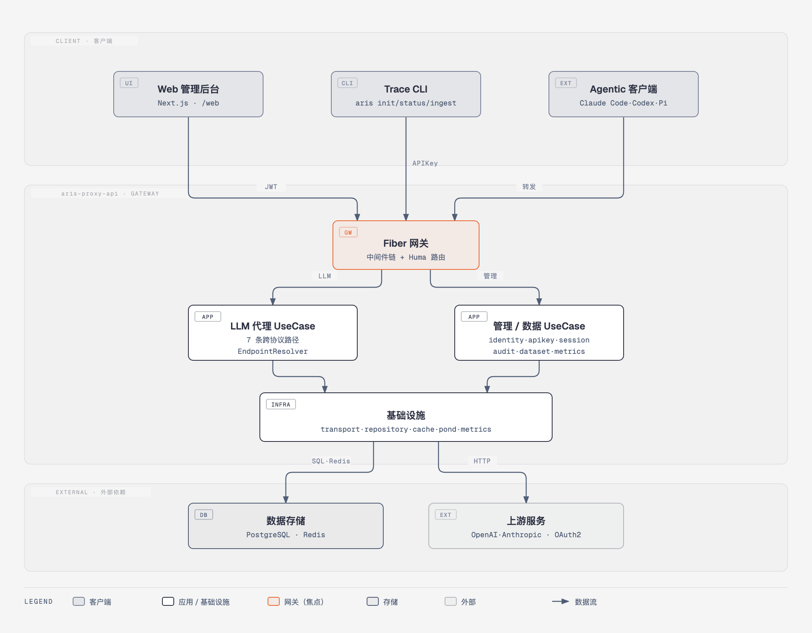

**LLM 代理链路**：鉴权/限流/敏感词 → 端点解析 → 跨协议转换 → 上游；响应同步返回，消息与审计经 Pond 协程池异步落库，不阻塞请求。

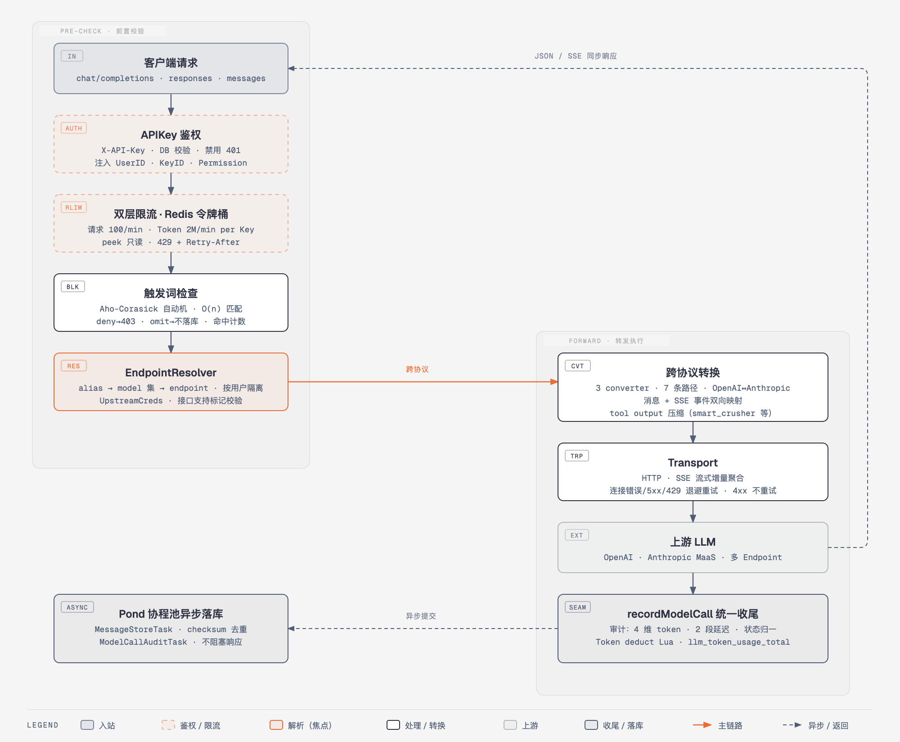

**会话数据模型与生命周期**：LLM 转发与 Trace 摄取两路写入 Session 聚合根，Message/Tool 按 checksum 内容寻址去重，审计、缓存、导出与后台消费围绕其展开。

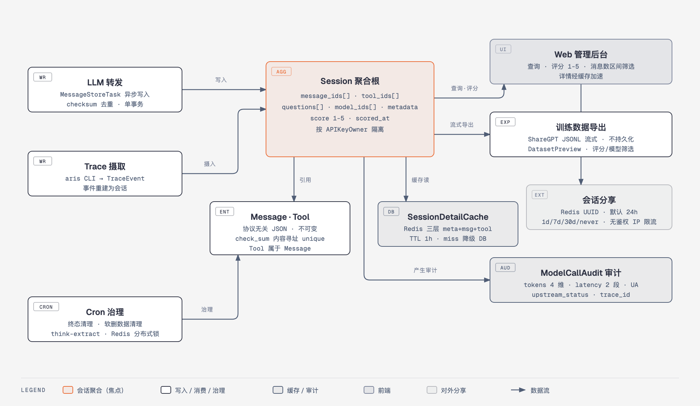

**Agent Harness Trace 摄取**：Codex / Claude Code Hook 与 Rollout 事件由 `aris` CLI（fail-open）本地 spool 批量上报，鉴权去重后落库，Web 端投影为可阅读的调用链路。

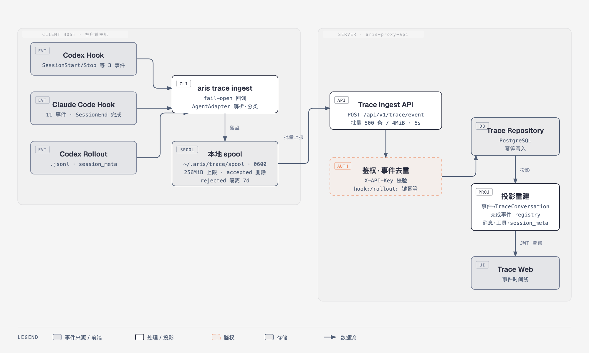

**Web 管理后台前端架构**：浏览器加载静态导出产物 → 根布局 Provider 链（I18n → Theme → Auth）→ 路由组（后台 14 页 / 公开 3 页，管理员页由 `PermissionGuard` 守卫）→ 组件与 6 个通用 hooks → `src/lib` 作为唯一后端出入口（Bearer 注入、401 单飞刷新、错误码 toast、数据集 SSE 导出）。

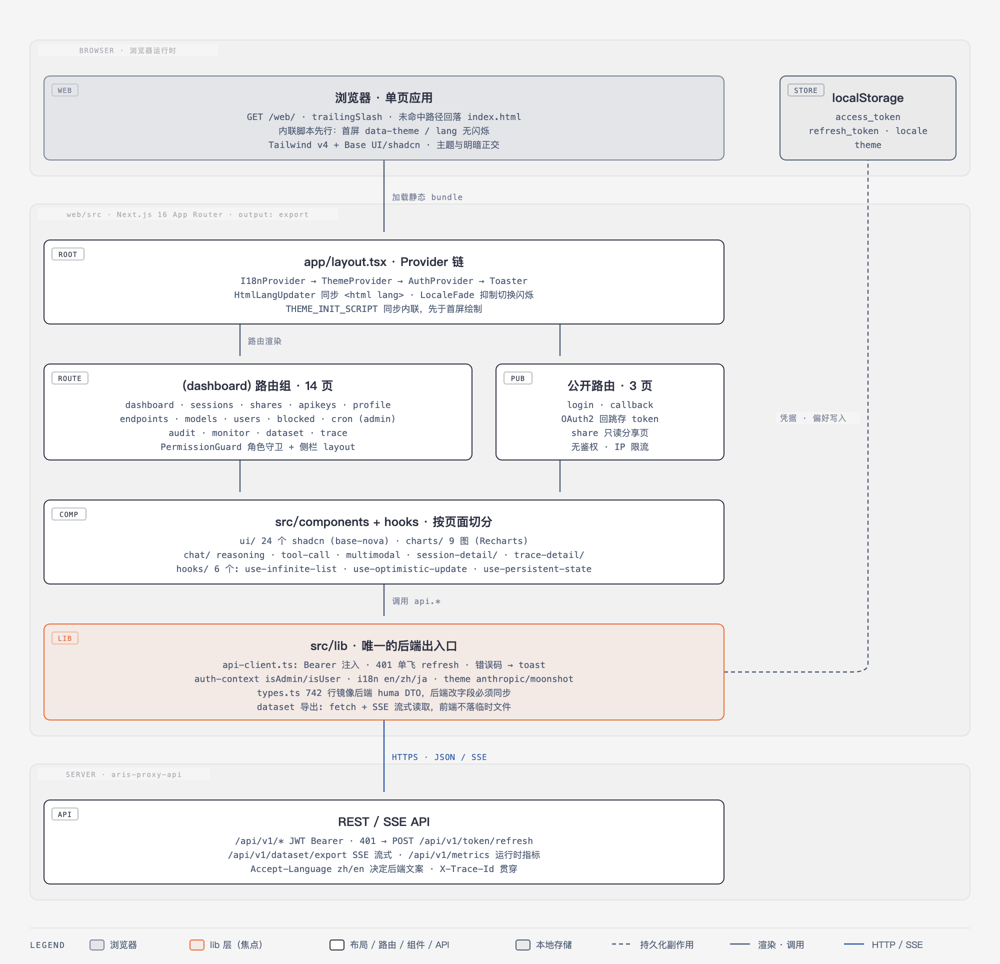

**前端构建与内嵌交付**：`next build` 静态导出（`basePath: /web`）→ `make web-build` 拷贝并逐文件 `gzip -9` 预压缩（10MB → 3.5MB）→ `embed.FS` 随服务端二进制发布 → `/web/*` 显式解析 `Accept-Encoding` 直发预压缩内容，非静态路径回落 `index.html`。

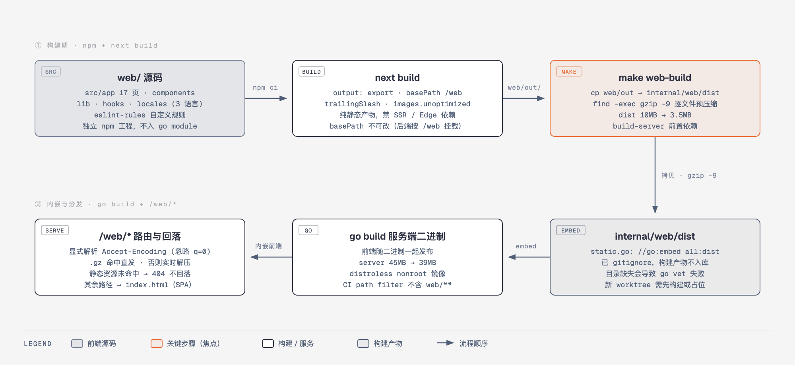

**运行时指标采集**：进程内 `HTTPCollector`（请求时延 histogram + 成功/失败 counter）、`SSEGauge`（SSE 并发连接）、`TokenUsageCounter`（输入/输出 token 吞吐）与 Go runtime 采集器（`go_goroutines` / `go_memstats_alloc_bytes` / `process_cpu_seconds_total`）注册进 Prometheus Registry；每 Pod 一个 `MetricsFlusher` 周期（5s）`BuildSnapshot` 把快照写入 Redis（ZSET `metrics:runtime:data:{pod}` + 实例注册表，retention 24h 清理）；运行时大盘经聚合层对相邻快照做 gauge 桶内均值 / counter 正向 delta÷桶宽 / histogram 桶合并求 P95，产出 QPS / P95 / 成功率 / CPU% / tokens·s；`/metrics` 端点经 `promhttp.Handler` 直读本 Pod Registry。

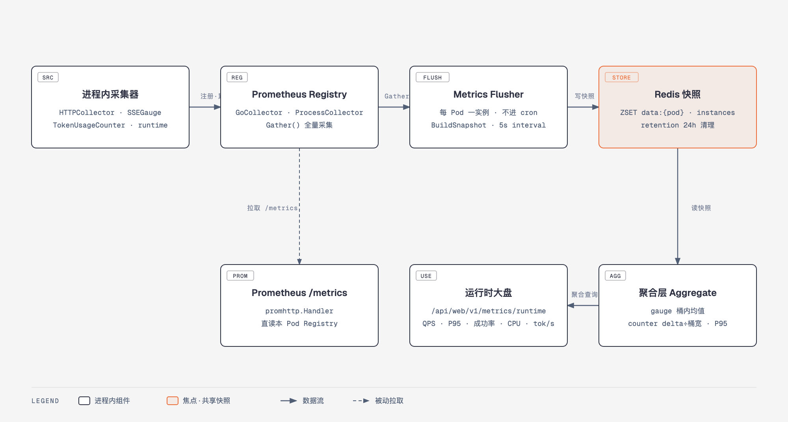

**优雅退出**：`SIGINT` / `SIGTERM` 触发 `fx.Lifecycle.OnStop` 逆序执行（注册顺序 Redis → DB → BlockedService → Logger → HTTP → Flusher → Inflight → Pool → Cron，故 OnStop 反序）；依次停 cron（`CronManager.StopAll`，3min）→ 停 `pond` 协程池（`StopWithContext`，3min）→ `inflight` drain 等在途（5min）→ 关 HTTP（`ShutdownWithContext` 30s，泄流 SSE 长连接，停 Flusher）→ 同步日志 + 停 BlockedService pub/sub → 关 DB → 关 Redis；K8s 配合 `preStop sleep 10` + `terminationGracePeriodSeconds 660` 无损下线。

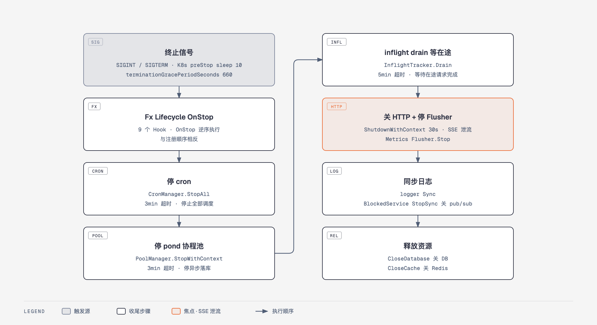

**敏感词热更新**：管理后台 `/api/v1/block` 写入 DB 后 `NotifyChanged` 经 Redis `Publish(blocked:changed)` 即时信号 + `INCR(blocked:version)` 版本广播；各 Pod `BlockedService` 通过 pub/sub 订阅、版本轮询（2s）与低频兜底（5min）三重同步触发全量 `Rebuild`（`ListAll` 重建内存 Aho-Corasick matcher）；LLM 请求经 `Check` 命中后按 action 拦截（deny）/ 打码（omit），命中计数经 `BlockedHitSync` cron（每 5min `PopAll` → `BatchIncrementHitCount`）批量回写 DB。

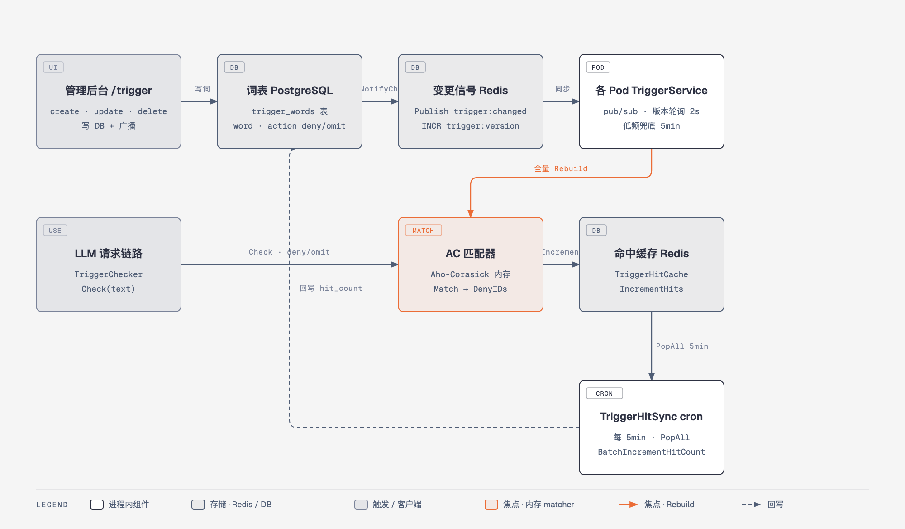

**定时任务触发与执行**：管理后台 `/api/v1/cron` 更新 spec / enabled（`update_cron_job` 校验 spec、核心任务禁关）或手动触发 `CronManager.Trigger`；`CronManager` 热重载（`Restart` / `Enable` / `Disable`）并经 `cron:reload` Redis pub/sub 跨 Pod 广播（其他 Pod `handleMessage` 同步）；任务以 Redis 分布式锁（`cron:lock:{name}`，TTL 5min + ticker 续期）保证单实例执行，`wrapCronFunc` 注入 traceID / enabled 检查 / panic 恢复，4 个任务（dedup 每小时 / purge 周日 04:00 / think 每日 00:00 / hit-sync 每 5min）每次执行落 `CronCallAudit`（status + duration + trigger source）。

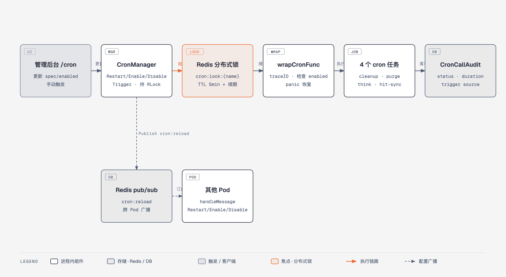

## 技术栈

| 层 | 技术 |
| --- | --- |
| 后端 | Go 1.25 · Fiber v3 · Huma v2 · Cobra · Viper · Uber Fx |
| 数据 | PostgreSQL + GORM · Redis（缓存/令牌桶/Cron 锁）· SQLite（单测）· Pond 协程池 |
| 可观测 | Zap + Lumberjack · 腾讯云 CLS · Prometheus · fgprof · `X-Trace-Id` 链路追踪 |
| 前端 | Next.js 16 (App Router) · React 19 · TypeScript · Tailwind CSS 4 · Base UI/shadcn · Recharts · Mermaid |
| 交付 | 前端静态产物 gzip 预压缩 + `embed.FS` 内嵌 · Docker 多阶段构建（Distroless nonroot）· Docker Compose · Kubernetes · GitHub Actions |

## 快速开始

### 环境要求

- Go 1.25+、Node.js 22+（仅前端开发/构建需要）
- PostgreSQL、Redis（可用 Docker Compose 启动）

### 启动依赖与配置

```bash
git clone https://github.com/hcd233/aris-proxy-api.git
cd aris-proxy-api
go mod download

# 准备配置（按需修改数据库、Redis、JWT Secret、OAuth2 等）
cp env/api.env.template env/api.env
cp env/postgresql.env.template env/postgresql.env
cp env/redis.env.template env/redis.env

# 启动 PostgreSQL 和 Redis
docker volume create postgresql-data && docker volume create redis-data
docker compose -f docker/docker-compose-full.yml up -d
```

### 迁移并启动服务

```bash
# 数据库迁移
go run ./cmd/server database migrate

# 构建前端并嵌入（生产模式必需；纯后端开发可跳过）
make web-build

# 启动服务
go run ./cmd/server server start --host localhost --port 8080
```

启动后访问：

- 管理后台 `http://localhost:8080/`
- 健康检查 `/health` · 就绪检查 `/ready` · SSE 健康检查 `/ssehealth`
- 开发环境 API 文档 `/docs`、OpenAPI `/openapi.json`（生产环境自动关闭）

首次使用：通过 OAuth2 登录管理后台 → 管理员审核用户 → 创建 Proxy API Key → 配置 Endpoint 和 Model → 即可用 OpenAI/Anthropic 兼容接口调用。

### 前端独立开发

```bash
cd web && npm ci && npm run dev   # http://localhost:3000
```

## 常用命令

| 命令 | 说明 |
| --- | --- |
| `make build` | 生产构建服务端 + 四平台 Trace 客户端 |
| `make build-server` / `make build-client[-all]` | 分别构建服务端 / `aris` 客户端 |
| `make web-build` | 构建前端到 `internal/web/dist` 并 gzip 预压缩 |
| `make test` / `make test-cover` | 全量测试 / 覆盖率报告 |
| `make lint` | 自定义规范 lint（`lint conv`）+ 静态检查（vet/staticcheck/golangci-lint） |
| `make web-lint` / `make web-format` | 前端 ESLint / Prettier |
| `make fgprof` | 拉取远程 fgprof profile 并打开火焰图 |

服务端 CLI：`server start`、`database migrate`、`lint conv/static`（`cmd/server`）；Trace 客户端 CLI：`aris init`、`aris trace ingest`、`aris status`（`cmd/client`）。

## API 概览

所有 API 由 Huma 注册并生成 OpenAPI，开发环境可在 `/docs` 交互查看。

| 前缀 | 认证 | 说明 |
| --- | --- | --- |
| `/api/openai/v1` · `/api/anthropic/v1` | `X-API-Key` | LLM 兼容入口：chat/completions、responses、messages、count_tokens、models |
| `/api/v1/trace/event` · `/trace/client/check` | `X-API-Key` | Trace 事件上报与客户端 Key 检查 |
| `/api/v1/oauth2` · `/token` | 公开（限流） | OAuth2 登录/回调、Token 刷新 |
| `/api/v1/user` | JWT | 个人资料；管理员可列表、审核（approve/demote）、删除用户 |
| `/api/v1/apikey` · `/session` · `/dataset` · `/trace` | JWT + Owner 隔离 | API Key、会话/分享、数据集导出、Trace 查询 |
| `/api/v1/endpoint` · `/model` · `/block` · `/cron` · `/audit/cron` · `/metrics` | JWT + admin | 端点、模型、敏感词、Cron 管理/触发、Cron 审计、运行时指标 |
| `/api/v1/audit` | JWT | 模型调用审计与统计（管理员可见全局） |
| `/health` `/ready` `/ssehealth` `/metrics` `/install.sh` | 公开 | 探针、Prometheus 指标、Trace 客户端安装脚本 |

## 部署

- **单机 Compose**：`docker compose -f docker/docker-compose-single.yml up -d`（需 `env/api.env`、`IMAGE_TAG` 和外部网络 `1panel-network`，迁移容器成功后 API 才启动，宿主机 `7070` → 容器 `8080`）；开发环境用 `docker-compose-dev-single.yml`（`7060` 端口）。
- **Kubernetes**：Deployment + Service + ConfigMap/Secret，滚动更新；`preStop` + draining + `terminationGracePeriodSeconds` 支持 SSE 长连接无损下线。
- **CI**：GitHub Actions 构建 GHCR 镜像并发布 `aris` 客户端 Release（tar.gz + sha256），服务端 `/install.sh` 提供自包含安装脚本。

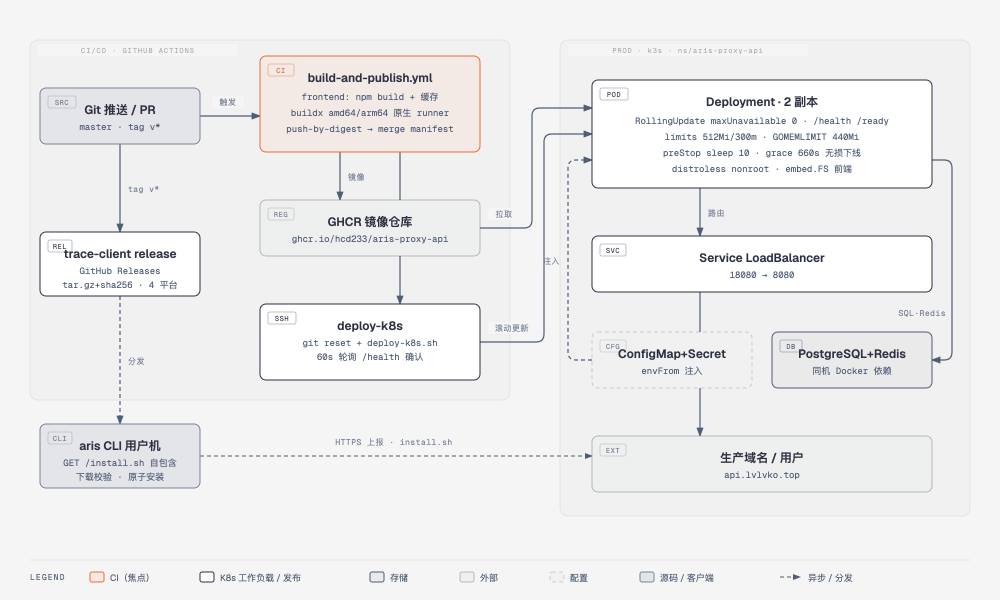

## 项目结构

```text
cmd/server        服务端入口（start / database migrate / lint）
cmd/client        aris Trace 客户端入口
internal/
  router/         路由注册（Huma Operation + 中间件绑定）
  handler/        HTTP 适配层
  application/    用例编排（identity/session/llmproxy/trace/...）
  domain/         领域模型与规则
  infrastructure/ GORM Repository、Redis、JWT、LLM Transport、协程池
  cron/           定时任务（Session 去重、孤儿清理、Think 提取、敏感词命中同步）
  bootstrap/      Fx 依赖注入与生命周期
  web/dist        前端构建产物（embed.FS）
web/              Next.js 管理后台源码
  src/app/        App Router 路由组（(dashboard) 14 页 · login / callback / share）
  src/components/ 基础与业务组件（ui / charts / chat / session-detail / trace-detail）
  src/lib/        api-client · auth-context · i18n · theme · types（后端 DTO 镜像）
docker/           Dockerfile 与 Compose 配置
env/              环境变量模板
docs/             设计文档与架构图
test/             单元测试与 E2E 测试
```

## 文档

- 架构图集：[docs/diagrams/](docs/diagrams/)
- 设计与排障文档：[docs/](docs/)
- 开发规范（面向贡献者与 AI Agent）：[AGENTS.md](AGENTS.md) 与 [docs/agents/](docs/agents/)

## License

[Apache License 2.0](LICENSE)
